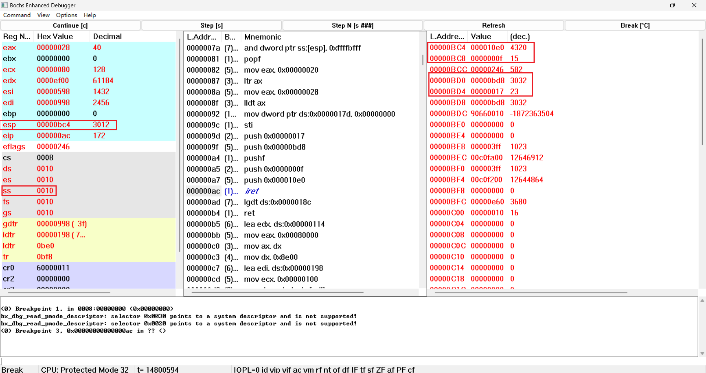
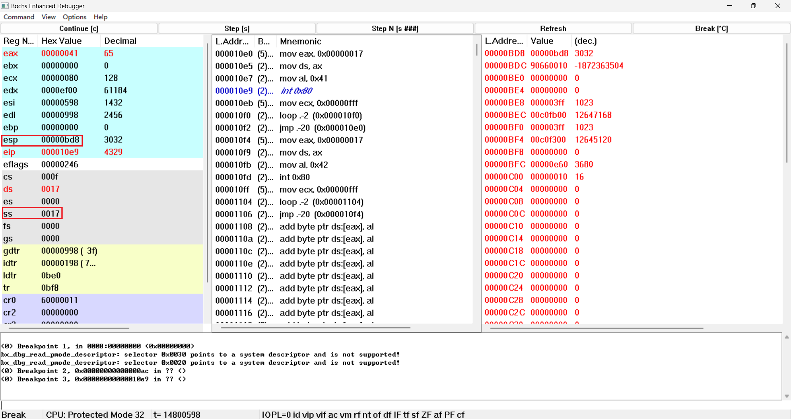

# 实验一   调试分析 Linux 0.00 引导程序

## 1.请简述 head.s 的工作原理

head.s 是 Linux 0.00 的内核程序，它实现了两个运行在用户态（特权级别3）的任务，分别称为任务 A 和任务 B（或任务 0 和任务 1），它们会调用一个显示系统调用在屏幕上分别显示出字符’A’和’B’，直到每个 10 毫秒切换到另一个任务。head.s 的工作原理如下：

- 首先，head.s 定义了一些数据段和代码段，并初始化了一些变量和数据结构，例如 GDT 表，IDT 表，TSS 结构，LDT 表等。
- 然后，head.s 定义了一个 startup_32 函数，它是内核的入口点。这个函数首先设置好 GDT 指针和 IDT 指针，并加载到 GDTR 和 IDTR 寄存器中。然后，它初始化 8259A 可编程中断控制器，并开启时钟中断。接着，它设置好 TSS 段选择子和 LDT 段选择子，并加载到 TR 和 LDTR 寄存器中。最后，它调用一个 switch_to 函数，用于切换到第一个任务（任务 A）。
- switch_to 函数是一个用汇编语言编写的函数，它负责保存当前任务的寄存器状态，并加载下一个任务的寄存器状态。它使用了 ljmp 指令来实现任务切换，即通过修改 CS 和 EIP 寄存器来跳转到下一个任务的代码段和入口地址。同时，它也会修改 SS 和 ESP 寄存器来切换到下一个任务的栈段和栈指针。
- 任务 A 和任务 B 都是用 C 语言编写的函数，它们分别定义在 taskA.c 和 taskB.c 文件中。它们都是无限循环的函数，每次循环都会调用一个显示系统调用来在屏幕上打印出相应的字符。显示系统调用是通过 int 0x80 指令来实现的，即触发一个软中断，并由内核来处理。
- 内核处理软中断的代码定义在 head.s 中的 system_call 标号处。这段代码首先保存当前任务的寄存器状态，并检查系统调用号是否合法。如果合法，则根据系统调用号来执行相应的操作。在本例中，只有一个系统调用号为 0x0 的显示系统调用，它会根据传入的参数（字符和颜色）来修改显存中的相应位置，从而在屏幕上显示出字符。如果系统调用号不合法，则返回错误码。
- 在执行完系统调用后，内核会恢复当前任务的寄存器状态，并使用 iret 指令返回到用户态继续执行当前任务。
- 在用户态执行过程中，每隔 10 毫秒就会发生一次时钟中断（由 8253 定时器产生），并由内核来处理。内核处理时钟中断的代码定义在 head.s 中的 timer_interrupt 标号处。这段代码首先保存当前任务的寄存器状态，并发送 EOI 命令给 8259A 控制器来结束中断请求。然后，它调用 switch_to 函数来切换到另一个任务，并使用 iret 指令返回到用户态继续执行另一个任务。
- 通过这样的方式，任务 A 和任务 B 就会在时钟中断的控制下相互切换运行，从而实现了一个简单的多任务内核。

## 2.请记录 head.s 的内存分布状况，写明每个数据段，代码段，栈段的起始与终止的内存地址

head.s 的内存分布状况如下：

| 段属性      | 起始地址 | 终止地址 | 大小 | 备注                                                         |
| ----------- | :------- | :------- | :--- | ------------------------------------------------------------ |
| 内核代码段  | 0x000000 | 0x7FFFFF | 8MB  | 对应GDT选择子0x08                                            |
| 内核数据段  | 0x000000 | 0x7FFFFF | 8MB  | 对应GDT选择子0x10。这个段同时也被栈所使用，初始栈顶位于 init_stack 处，栈空间512字节。另外，在中断时进入到内核态时，此时的内核栈对应 krn_stK1 处的512字节 |
| 显存段      | 0xB80000 | 0xB9FFF  | 8KB  | 对应GDT选择子0x18                                            |
| task0代码段 | 0xD00000 | 0x7FFFFF | 8MB  | 对应LDT0选择子0x0F                                           |
| task0数据段 | 0x000000 | 0x7FFFFF | 8MB  | 对应LDT0选择子0x17。这个段同时也被栈所使用，初始栈顶位于 init_stack 处，栈空间512字节 |
| task1代码段 | 0x000000 | 0x7FFFFF | 8MB  | 对应LDT1选择子0x0F                                           |
| task1数据段 | 0x000000 | 0x7FFFFF | 8MB  | 对应LDT0选择子0x17。这个段同时也被栈所使用，初始栈顶位于 usr_stk1 处，栈空间512字节 |

## 3.简述 head.s 57 至 62 行在做什么？

- 这部分代码是在 switch_to 函数中，用于切换到任务 A（或任务 0）。它的作用是：
  - pushl $0x17：将任务 A 的栈段选择子（0x17）压入栈中，作为新的 SS 寄存器的值。
  - pushl $init_stack：将任务 A 的栈指针（init_stack）压入栈中，作为新的 ESP 寄存器的值。
  - pushfl：将当前的标志寄存器（EFLAGS）压入栈中，作为新的 EFLAGS 寄存器的值。
  - pushl $0x0f：将任务 A 的代码段选择子（0x0f）压入栈中，作为新的 CS 寄存器的值。
  - pushl $task0：将任务 A 的入口地址（task0）压入栈中，作为新的 EIP 寄存器的值。
  - iret：执行中断返回指令，从栈中弹出五个值，并分别赋给 EIP，CS，EFLAGS，ESP 和 SS 寄存器。这样就完成了任务切换，并跳转到任务 A 的代码段和入口地址继续执行。

## 4.简述 iret 执行后， pc 如何找到下一条指令？

`iret`指令用于从中断处理程序中返回到被中断的程序，并恢复被中断程序的现场。执行`iret`指令后，处理器会执行以下操作：

1. 弹出SS和ESP寄存器中的值，以恢复被中断程序的堆栈指针。
2. 从堆栈中弹出EFLAGS寄存器的值，以恢复被中断程序的标志位。
3. 从堆栈中弹出CS和EIP寄存器的值，以恢复被中断程序的代码指针。

因此，`iret`指令执行后，程序计数器PC将指向被中断程序被中断前执行的下一条指令。具体来说，`iret`指令会将从堆栈中弹出的CS和EIP寄存器的值组合成一个32位的线性地址，然后将该线性地址存储在程序计数器PC中，以便继续执行被中断程序被中断前的指令。

## 5.记录 iret 执行前后，栈是如何变化的？

打开Bochs，在文本框输入调试命令vb 0x08:0，在内核程序的入口处插个断点，处理器就执行到内核程序入口前。在反汇编窗口区里找到跳转到task0的`iret`指令，在这条指令处插个断点。

执行`iret`前，栈顶SS:ESP 指向0x10:0x0BC4，栈中看到之前往栈顶里压入的跳转目标地址0x0F:0x10E0 和用户栈栈顶地址0x17:0x0BD8。

点Step[s]，仅执行`iret`指令，栈顶SS:ESP自动切换到之前指定的用户栈栈顶0x17:0x0BD8，而且现在CS:EIP 跳转到了0x0F:0x10E0 执行。

可以看出，iret 执行后，栈顶向下移动了 12 字节，即弹出了三个值。其他的寄存器值没有变化。

## 6.当任务进行系统调用时，即 int 0x80 时，记录栈的变化情况。

处理器执行到`int 0x80`之前，现在栈顶SS:ESP指向0x17:0x0BD8，此时CS:EIP=0x0F:0x10E9

点Step[s]执行指令，观察栈的变化：

SS:ESP切换到了task0内核栈0x10:0x0E4C处，并且CS:EIP跳转到了系统调用中断处理程序入口地址0x08:0x0166处。并且原来的用户栈栈顶地址0x17:0x0BD8和中断返回地址0x0F:0x10EB被压到了内核栈栈顶。