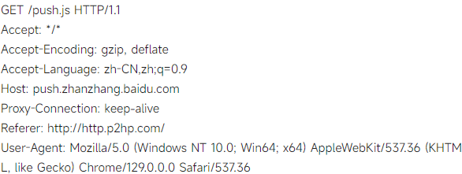

# 实验一：HTTP 代理服务器的设计与实现

## 如何运行
- 设置terminal为utf-8字符集
- 带有`-lWs2_32`参数的编译命令
- 相对路径执行exe文件

``` shell
chcp 65001
g++ -fdiagnostics-color=always -g .cpp -o .exe -lWs2_32

chcp 65001
g++ -fdiagnostics-color=always -g czy.cpp -o czy.exe -lWs2_32 

```

## 实验分析
使用C++语言，尽可能避免对指针的使用。

- 需求一
  - `8080`端口接收`HTTP`请求，解析url，获取host和port，建立与host的连接，转发请求和响应。
- 需求二
  - 支持`Cache`，可以缓存服务器响应对象， 并能够通过修改请求报文（添加 `if-modified-since`
头行），向原服务器确认缓存对象是否是最新版本。
- 需求三
  - 网站过滤，可以通过配置文件，对特定的网站进行过滤，拒绝访问。
  - 用户过滤，可以通过配置文件，对特定的用户进行过滤，拒绝访问。
  - 网站引导，对某个网站的访问进行引导，引导到另一个网站。
- 需求四
  - 多线程`_beginthreadex`创建线程，实现多用户并发访问。`_endthreadex`结束线程。


## 一些问题的解决

```cpp
recvSize = recv(((ProxyParam*)lpParameter)->clientSocket, Buffer, MAXSIZE, 0);
```

这段代码的作用是从客户端的套接字接收数据。具体来说：

1. `((ProxyParam*)lpParameter)->clientSocket`：通过将传入的参数 `lpParameter` 转换为 `ProxyParam` 类型的指针，获取客户端的套接字。
2. `Buffer`：用于存储接收到的数据的缓冲区。
3. `MAXSIZE`：指定了缓冲区的最大大小，即最多接收 `MAXSIZE` 字节的数据。
4. `0`：表示没有特殊的标志位。

`recv` 函数会从客户端的套接字中读取数据，并将其存储在 `Buffer` 中。读取的数据量（字节数）会存储在 `recvSize` 变量中。如果读取失败，`recvSize` 会是一个负值。


## HTTP请求头的示例




## 函数之间的调用关系
在这个 HTTP 代理服务的代码中，各个函数之间的关系和作用如下：

1. **`_tmain`**: 程序的入口点，负责初始化套接字，监听客户端连接，并为每个连接创建新的线程（`ProxyThread`）。

2. **`InitSocket`**: 初始化套接字，设置网络参数，绑定端口，并开始监听连接。

3. **`ProxyThread`**: 每个线程处理一个客户端请求。接收来自客户端的数据，解析 HTTP 头部（调用 `ParseHttpHead`），检查缓存，转发请求到目标服务器，接收服务器的响应，并将其发送回客户端。

4. **`ParseHttpHead`**: 解析 HTTP 请求头，提取请求方法和 URL。

5. **`ConnectToServer`**: 建立与目标服务器的连接（未在代码中详细实现）。

6. **`sendnewHTTP`**: 发送新的 HTTP 请求（涉及到缓存逻辑）。

7. **`makeFilename`**: 根据 URL 生成文件名，用于缓存存储。

8. **`storefileCache`** 和 **`checkfileCache`**: 处理缓存文件的存储和检查。

接收请求、解析头部、连接目标服务器、转发请求和响应，最终将结果返回给客户端。

以下是一个合理的函数编码顺序，考虑到函数之间的依赖关系和逻辑流程：

1. **`InitSocket`**: 首先实现这个函数，以便在程序启动时初始化套接字和网络参数。 ——实现

2. **`_tmain`**: 实现主入口点，调用 `InitSocket`，并设置监听和线程创建的逻辑。——实现

3. **`ProxyThread`**: 编写处理客户端请求的线程函数，依赖于 `ParseHttpHead` 和其他处理函数。 —— 半实现

4. **`ParseHttpHead`**: 实现解析 HTTP 请求头的功能，为 `ProxyThread` 提供请求数据解析。——实现

5. **`ConnectToServer`**: 在 `ProxyThread` 中调用此函数，以建立与目标服务器的连接。

6. **`sendnewHTTP`**: 实现发送新的 HTTP 请求的逻辑，通常在 `ProxyThread` 中使用。

7. **`makeFilename`**: 根据 URL 生成缓存文件名的逻辑，可以在 `sendnewHTTP` 或 `storefileCache` 中调用。

8. **`storefileCache`**: 处理缓存存储的逻辑，可以在 `sendnewHTTP` 中使用，以存储响应数据。

9. **`checkfileCache`**: 实现缓存检查的功能，可以在 `ProxyThread` 开始处理请求时调用，以优化请求过程。

这种顺序保证了各个函数的功能和逻辑顺畅连接，便于调试和后续扩展。

## 创建套接字过程
- 指定`WSA`(windows socket api)的版本为`2.2`
- 调用`WSAStartup`函数加载`winsock DLL`
- 创建`socket`，指定协议族、套接字类型和协议（协议族为`0`由服务商提供合适协议，套接字类型不太清楚，选择`SOCK_STREAM` 表示**顺序、可靠、双向的连接流**，地址族指定的是`ipv4`还是`ipv6`）
- 设置套接字地址结构，指定地址族、端口号和ip地址(ip地址是接受特定地址的连接，实验中设置为`127.0.0.1`)
- 绑定套接字和套接字地址结构
- 监听套接字，指定最大连接数

## 未实现功能
- 对用户ip进行过滤
- ?未知 如何判断页面缓存过期

- datebuffer和clientbuffer没有使用


## magic 
- `strstr(a1, a2)` 返回`a2`首次出现在`a1`位置的指针


## 关于cache的实现


## 9.29 未实现
- 网站引导，对某个网站的访问进行引导，引导到另一个网站。
- cache实现。
- 用户过滤


## C++ 中goto的使用标准
``` shell
czy.cpp: In function 'unsigned int ProxyThread(LPVOID)':
czy.cpp:412:1: error: jump to label 'error'
  412 | error:
      | ^~~~~
czy.cpp:379:28: note:   from here
  379 |     if (recvLen <= 0) goto error;
      |                            ^~~~~
czy.cpp:384:17: note:   crosses initialization of 'HttpHeader* httpHeader'
  384 |     HttpHeader* httpHeader = new HttpHeader();
      |                 ^~~~~~~~~~
czy.cpp:380:10: note:   crosses initialization of 'char cacheBuffer [(recvLen + 1)]'
  380 |     char cacheBuffer[recvLen+1];
      |          ^~~~~~~~~~~
czy.cpp:415:12: warning: deleting array 'cacheBuffer'
  415 |     delete cacheBuffer;
      |            ^~~~~~~~~~~
```

### Reply
> 这个错误与 跳转语句 (goto) 跨过变量初始化 有关。C++ 不允许 goto 跳过某些带有构造函数或自动分配内存的局部变量的初始化（如数组、指针等），特别是 HttpHeader* httpHeader 和 char cacheBuffer[recvLen+1] 的初始化。这两个变量在 goto error 之前被定义，而 goto error 会跳过这两个变量的初始化。这是 C++ 的语法规则，不允许跳过变量的初始化。


## 做了
- HTTPS代理过滤
- 过滤用户ip
- 过滤host