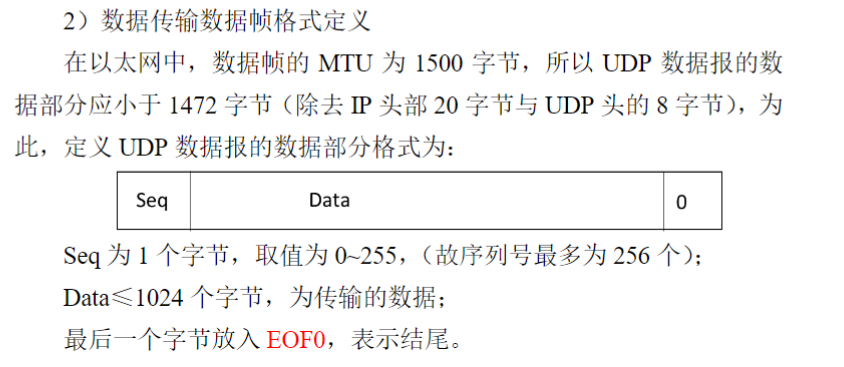

## 实验2、3

- 实验2是实现一个简单的停等协议
- 实验3是实现GBN协议和SR协议，实际上实验2就是GBN协议在窗口大小为1的特殊情况，所以本次实现主要针对实验三进行实现。
- UDP是无链接的，TCP由于有链接的需求，服务器需要监听端口，并且accept来自client的请求。

数据帧定义

---

## 可行的实现方案

### 关键概念：

- **GBN（Go-Back-N）**：GBN协议中，发送方可以在等待ACK之前发送多个数据包，但接收方只能按序接收数据包。如果一个数据包丢失，接收方将丢弃之后的所有数据包，直到丢失的数据包被重传。
- **SR（Selective Repeat，选择重传）**：SR协议允许接收方接收无序的数据包并分别发送ACK。只有丢失的数据包需要重传。

### 实现步骤：

#### 1. **初始化和配置Socket**

- 客户端和服务器都使用**UDP套接字**进行通信。
- 将套接字设置为非阻塞模式（可以使用 `ioctlsocket`）或根据实验需求设置阻塞模式，并配置超时功能来模拟真实网络环境中的传输延迟。

#### 2. **滑动窗口的数据结构（GBN和SR）**

- 定义**发送窗口大小**（`SEND_WIND_SIZE = 10`）和**序列号空间**（`SEQ_SIZE = 20`）。
- 客户端和服务器都维护一个**ack数组**来记录接收到的数据包情况，用于处理确认（ACK）的发送与接收。

#### 3. **协议逻辑**

- **GBN协议**：

  1. **客户端**在窗口大小范围内发送一批数据包，等待累积确认（ACK）。
  2. 如果某个数据包丢失或ACK未能收到（通过 `lossInLossRatio()`函数模拟丢包），**服务器**会只返回最后一个按序接收到的ACK，客户端需要从该未确认的数据包开始重新发送。
- **SR协议**：

  1. **客户端**发送数据包，**服务器**逐个对每个数据包进行确认。
  2. 如果某个数据包丢失，只有丢失的数据包会在超时后重新传输。

#### 4. **数据包丢失模拟**

- 使用 `lossInLossRatio()`函数在传输过程中随机模拟数据包丢失和ACK丢失：
  - 如果生成的随机数小于设定的丢包率，则该数据包将被丢弃。
  - 同样的逻辑用于模拟ACK丢失。

#### 5. **定时器与超时处理**

- 在客户端实现**定时器**，用于检测超时并在超时后重新传输数据包。
- 使用 `timeoutHandler()`函数处理超时逻辑，对于GBN协议，将从上次未确认的序列号开始重新发送所有数据包；对于SR协议，只重传丢失的数据包。

#### 6. **文件传输的实现**

- 实现**下载**和**上传**功能：
  - **下载**场景中，客户端请求文件，服务器使用GBN或SR协议发送文件，客户端逐个接收并发送ACK。
  - **上传**场景中，客户端向服务器发送文件，同样按照协议进行数据传输。

#### 7. **处理特殊情况**

- 处理序列号的回绕情况（序列号空间是有限的，必须正确处理序列号的循环）。
- 如果窗口内所有数据包丢失，确保能够正确重传。

### 示例：GBN协议中的服务器端流程

```cpp
for (int i = 0; i < totalPacket; i++) {
    if (seqIsAvailable()) {
        sendPacketToClient(curSeq);  // 发送当前序列号的数据包
        curSeq = (curSeq + 1) % SEQ_SIZE;
    }

    // 检查是否收到ACK
    int recvSize = recvfrom(sockServer, buffer, BUFFER_LENGTH, 0, &addrClient, &length);
    if (recvSize > 0) {
        ackHandler(buffer[0]);  // 处理ACK
    }

    // 如果未收到ACK，处理超时并重传
    if (timeoutOccurred()) {
        timeoutHandler();  // 重传整个窗口中的数据
    }
}
```

### 测试：

- 通过调整数据包和ACK丢失率（丢包概率和ACK丢失概率），测试在不同网络条件下协议的表现。
- 使用客户端中的 `-testgbn`和 `-testsr`命令来启动测试，指定不同的丢包率和ACK丢失率进行验证。

## Server main函数拆分后的实现

为了提高代码的可读性和可维护性，`main`函数可以拆分为多个独立的功能函数。以下是对 `main`函数的重构方案，将不同的功能模块化并分解为独立的函数。

### 拆分后的代码结构

1. **初始化网络部分**：用于启动套接字并进行基本的网络配置。
2. **绑定端口和地址**：用于将服务器绑定到特定的IP和端口。
3. **数据传输与处理**：负责处理客户端的请求，处理GBN和SR协议的数据传输逻辑。
4. **关闭套接字与清理**：在程序结束时清理资源。

#### 1. 初始化网络部分

```cpp
int initializeNetwork() {
    // 加载套接字库（必须）
    WORD wVersionRequested = MAKEWORD(2, 2);
    WSADATA wsaData;
    int err = WSAStartup(wVersionRequested, &wsaData);
  
    if (err != 0) {
        // 找不到 winsock.dll
        printf("WSAStartup failed with error: %d\n", err);
        return -1;
    }

    if (LOBYTE(wsaData.wVersion) != 2 || HIBYTE(wsaData.wVersion) != 2) {
        printf("Could not find a usable version of Winsock.dll\n");
        WSACleanup();
        return -1;
    }

    printf("The Winsock 2.2 dll was found okay\n");
    return 0;
}
```

#### 2. 绑定端口和地址

```cpp
SOCKET bindSocket() {
    SOCKET sockServer = socket(AF_INET, SOCK_DGRAM, IPPROTO_UDP);
    if (sockServer == INVALID_SOCKET) {
        printf("Socket creation failed\n");
        return INVALID_SOCKET;
    }

    // 绑定服务器地址和端口
    SOCKADDR_IN addrServer;
    addrServer.sin_addr.S_un.S_addr = htonl(INADDR_ANY); // 使用任意网络接口
    addrServer.sin_family = AF_INET;
    addrServer.sin_port = htons(SERVER_PORT);

    int err = bind(sockServer, (SOCKADDR*)&addrServer, sizeof(SOCKADDR));
    if (err == SOCKET_ERROR) {
        printf("Could not bind the port %d for socket. Error code: %d\n", SERVER_PORT, GetLastError());
        closesocket(sockServer);
        WSACleanup();
        return INVALID_SOCKET;
    }

    return sockServer;
}
```

#### 3. 数据传输与处理

针对不同的操作（如时间请求、文件传输等）分离成函数，并根据协议处理不同的阶段：

```cpp
void processClientRequest(SOCKET sockServer) {
    SOCKADDR_IN addrClient;
    int length = sizeof(SOCKADDR);
    char buffer[BUFFER_LENGTH]; // 用于数据接收与发送的缓冲区
    ZeroMemory(buffer, sizeof(buffer));
    int recvSize;

    while (true) {
        // 接收来自客户端的数据
        recvSize = recvfrom(sockServer, buffer, BUFFER_LENGTH, 0, (SOCKADDR*)&addrClient, &length);
        if (recvSize < 0) continue;

        printf("recv from client: %s\n", buffer);
  
        if (strcmp(buffer, "-time") == 0) {
            // 返回当前时间
            getCurTime(buffer);
        } else if (strcmp(buffer, "-quit") == 0) {
            // 客户端退出
            strcpy_s(buffer, strlen("Good bye!") + 1, "Good bye!");
        } else {
            // 根据不同的协议处理请求（如GBN或SR）
            handleProtocolRequest(sockServer, addrClient, buffer, length);
        }

        sendto(sockServer, buffer, strlen(buffer) + 1, 0, (SOCKADDR*)&addrClient, sizeof(SOCKADDR));
    }
}
```

#### 4. GBN协议处理

```cpp
void handleGBN(SOCKET sockServer, SOCKADDR_IN addrClient, char* buffer, int length) {
    // GBN协议的具体实现，处理文件传输的下载或上传
    // 根据 buffer 的内容区分不同操作，比如 download 或 upload
    // 同时处理握手阶段、数据包传输、ACK处理等逻辑
}
```

#### 5. 关闭套接字与清理

```cpp
void cleanup(SOCKET sockServer) {
    closesocket(sockServer);
    WSACleanup();
}
```

### 完整的重构后的 `main`函数

```cpp
int main() {
    // 初始化网络库
    if (initializeNetwork() == -1) {
        return -1;
    }

    // 绑定服务器套接字
    SOCKET sockServer = bindSocket();
    if (sockServer == INVALID_SOCKET) {
        return -1;
    }

    // 处理客户端请求（GBN、SR协议等）
    processClientRequest(sockServer);

    // 清理资源，关闭套接字
    cleanup(sockServer);

    return 0;
}
```

### 总结：

通过将 `main`函数的内容拆分成多个独立的函数，我们实现了功能的模块化，增强了代码的可读性和维护性。每个函数负责特定的功能，便于调试和扩展

### 剩余的代码实现（不完整）

接下来，我将补全对剩余代码的实现，主要包括**协议请求处理（GBN和SR协议）**和一些辅助功能的实现，如处理ACK、超时处理等。

### 1. **处理协议请求**

根据客户端发送的指令，判断是GBN协议还是SR协议，并根据操作执行上传或下载。

```cpp
void handleProtocolRequest(SOCKET sockServer, SOCKADDR_IN addrClient, char* buffer, int length) {
    char cmd[10];
    char operation[10];
    char filename[100];
    float packetLossRatio = 0.2; // 默认包丢失率
    float ackLossRatio = 0.2;    // 默认ACK丢失率
    sscanf(buffer, "%s %f %f %s %s", &cmd, &packetLossRatio, &ackLossRatio, &operation, &filename);

    if (strcmp(cmd, "gbn") == 0) {
        if (strcmp(operation, "download") == 0) {
            handleGBNDownload(sockServer, addrClient, filename, packetLossRatio, ackLossRatio, length);
        } else if (strcmp(operation, "upload") == 0) {
            handleGBNUpload(sockServer, addrClient, filename, packetLossRatio, ackLossRatio, length);
        }
    } else if (strcmp(cmd, "sr") == 0) {
        if (strcmp(operation, "download") == 0) {
            handleSRDownload(sockServer, addrClient, filename, packetLossRatio, ackLossRatio, length);
        } else if (strcmp(operation, "upload") == 0) {
            handleSRUpload(sockServer, addrClient, filename, packetLossRatio, ackLossRatio, length);
        }
    }
}
```

### 2. **GBN协议：下载**

```cpp
void handleGBNDownload(SOCKET sockServer, SOCKADDR_IN addrClient, char* filename, float packetLossRatio, float ackLossRatio, int length) {
    // 打开文件并读取数据
    std::ifstream fin(filename, ios_base::in);
    if (!fin.is_open()) {
        printf("无法打开文件\n");
        return;
    }

    char data[1024 * 113];  // 假设文件最大长度为113个块，每个块1024字节
    int loct = 0;
    char buff[1024];
    while (fin.getline(buff, sizeof(buff))) {
        memcpy(data + 1024 * loct, buff, 1024); // 读取文件
        ++loct;
    }
    fin.close();

    int totalPacket = loct;  // 总数据包数量
    int curSeq = 0, curAck = 0, totalSeq = 0;  // GBN协议的窗口变量
    BOOL ack[SEQ_SIZE] = { TRUE };  // ACK数组，用来追踪哪些包已经被确认
    int waitCount = 0;

    // 握手阶段，客户端准备好后才能发送数据
    initiateHandshake(sockServer, addrClient, length);

    // 开始数据传输
    while (curSeq < totalPacket) {
        if (seqIsAvailable(curSeq, curAck, ack)) {
            // 发送数据包，附带序列号
            sendPacket(sockServer, addrClient, curSeq, data, totalSeq, totalPacket, length);

            // 更新序列号
            curSeq = (curSeq + 1) % SEQ_SIZE;
            ++totalSeq;
        }

        // 等待ACK
        if (receiveAck(sockServer, addrClient, curAck, waitCount, ack, length, packetLossRatio, ackLossRatio)) {
            if (curAck == totalPacket) break;
        } else if (waitCount > 20) {
            timeoutHandler(curSeq, curAck, totalSeq, ack);  // 处理超时
            waitCount = 0;
        }
    }

    printf("GBN传输完成\n");
}
```

### 3. **GBN协议：上传**

```cpp
void handleGBNUpload(SOCKET sockServer, SOCKADDR_IN addrClient, char* filename, float packetLossRatio, float ackLossRatio, int length) {
    char data[1024 * 113];  // 假设最大可接收的数据块数为113
    int loct = 0;
    BOOL ack[SEQ_SIZE] = { FALSE };
    unsigned short recvSeq = 0, waitSeq = 1;

    int stage = 0;
    BOOL runFlag = true;
    while (runFlag) {
        int recvSize = recvfrom(sockServer, data, BUFFER_LENGTH, 0, (SOCKADDR*)&addrClient, &length);

        if (recvSize < 0) continue;  // 继续接收

        unsigned short seq = data[0];  // 获取数据包序列号
        if (seq == waitSeq) {
            // 按顺序接收数据
            ack[seq - 1] = TRUE;
            memcpy(data + 1024 * loct, data + 1, 1024);  // 将数据存入缓冲区
            ++loct;
            ++waitSeq;

            // 发送ACK
            sendAck(sockServer, addrClient, seq, length, ackLossRatio);
        }
    }

    // 将数据写入文件
    std::ofstream ofs(filename, ios::out);
    for (int i = 0; i < loct; ++i) {
        ofs.write(data + 1024 * i, 1024);
    }
    ofs.close();

    printf("GBN上传完成\n");
}
```

### 4. **SR协议：下载**

```cpp
void handleSRDownload(SOCKET sockServer, SOCKADDR_IN addrClient, char* filename, float packetLossRatio, float ackLossRatio, int length) {
    // 和GBN类似，SR的主要区别是可以接受乱序数据包
    // 这里要维护接收窗口，每个数据包都要单独确认
    char data[1024 * 113];
    BOOL ack[SEQ_SIZE] = { TRUE };  // 用于确认的数组
    int waitSeq = 0, curSeq = 0, totalSeq = 0, loct = 0;

    initiateHandshake(sockServer, addrClient, length);

    // 开始SR协议的下载
    while (curSeq < 113) {
        if (seqIsAvailable(curSeq, waitSeq, ack)) {
            sendPacket(sockServer, addrClient, curSeq, data, totalSeq, 113, length);
            ++curSeq;
        }

        // 等待ACK
        if (receiveAck(sockServer, addrClient, curSeq, waitSeq, ack, length, packetLossRatio, ackLossRatio)) {
            if (curSeq == 113) break;
        }
    }

    printf("SR协议传输完成\n");
}
```

### 5. **SR协议：上传**

```cpp
void handleSRUpload(SOCKET sockServer, SOCKADDR_IN addrClient, char* filename, float packetLossRatio, float ackLossRatio, int length) {
    // 和GBN类似，但SR协议可以处理乱序接收的数据包
    char data[1024 * 113];
    BOOL recvd[SEQ_SIZE] = { FALSE };
    int totalSeq = 0, loct = 0, waitSeq = 1;

    while (true) {
        // 接收来自客户端的数据包
        int recvSize = recvfrom(sockServer, data, BUFFER_LENGTH, 0, (SOCKADDR*)&addrClient, &length);

        // 模拟丢包情况
        if (recvSize > 0 && !lossInLossRatio(packetLossRatio)) {
            unsigned short seq = data[0];  // 获取包序列号
            if (!recvd[seq - 1]) {
                // 未接收的数据包，存入缓冲区
                recvd[seq - 1] = TRUE;
                memcpy(data + 1024 * loct, data + 1, 1024);
                ++loct;
            }

            // 发送ACK
            sendAck(sockServer, addrClient, seq, length, ackLossRatio);
        }

        if (loct == totalSeq) break;  // 所有数据包已接收
    }

    // 将数据写入文件
    std::ofstream ofs(filename, ios::out);
    for (int i = 0; i < loct; ++i) {
        ofs.write(data + 1024 * i, 1024);
    }
    ofs.close();

    printf("SR上传完成\n");
}
```

### 6. **超时处理、ACK处理和发送数据包**

```cpp
void timeoutHandler(int& curSeq, int curAck, int& totalSeq, BOOL* ack) {
    printf("超时重传...\n");
    curSeq = curAck;
    totalSeq = curAck;
    memset(ack, TRUE, sizeof(BOOL) * SEQ_SIZE);
}

void ackHandler(char* buffer) {
    unsigned char seq = buffer[0] - 1;  // 从收到的ACK中提取序列号
    ack[seq] = TRUE;  // 标记为已确认
}

void sendPacket(SOCKET sockServer, SOCKADDR_IN addrClient, int curSeq, char* data, int totalSeq, int totalPacket, int length) {


    char buffer[BUFFER_LENGTH];
    buffer[0] = curSeq + 1;  // 序列号
    memcpy(buffer + 1, data + totalSeq * 1024, 1024);  // 数据内容
    sendto(sockServer, buffer, BUFFER_LENGTH, 0, (SOCKADDR*)&addrClient, length);
}

void sendAck(SOCKET sockServer, SOCKADDR_IN addrClient, unsigned short seq, int length, float ackLossRatio) {
    char buffer[3];
    buffer[0] = seq + 1;
    buffer[1] = '1';
    buffer[2] = '\0';

    if (!lossInLossRatio(ackLossRatio)) {
        sendto(sockServer, buffer, 3, 0, (SOCKADDR*)&addrClient, length);
        printf("发送ACK：%d\n", seq);
    } else {
        printf("ACK丢失：%d\n", seq);
    }
}
```

### 总结

我们已经将 `main`函数中的各个逻辑模块拆解为多个独立的函数。通过这一拆分，可以更好地管理协议的各个部分，增强了代码的结构化和可读性。

## Client 的函数拆分实现

我们可以按照代码逻辑进行模块化拆分，逐步解释 `client.cpp` 的主要部分。我们将从头开始，按模块拆分并详细描述每个部分的功能。

---

### 1. **头文件与常量定义模块**

这是代码的起始部分，导入所需的头文件和定义常量，用于配置客户端程序的运行。

```cpp
#include <stdlib.h>
#include <WinSock2.h>
#include <time.h>
#include <stdio.h>
#include <fstream>
#include <sstream>
#include <cstdio>
#pragma comment(lib, "ws2_32.lib")
#pragma warning(disable:4996)

#define SERVER_PORT 12340 // 接收数据的端口号
#define SERVER_IP "127.0.0.1" // 服务器的 IP 地址

using namespace std;

const int BUFFER_LENGTH = 1027; // 缓冲区大小
const int SEQ_SIZE = 20; // 接收端序列号个数，为 1~20
BOOL ack[SEQ_SIZE]; // 存储收到的 ACK 状态，true 表示已确认
int curSeq; // 当前数据包的序列号
int curAck; // 当前等待确认的 ACK
int totalSeq; // 已接收的数据包总数
int totalPacket; // 需要发送的数据包总数
int waitSeq; // 等待接收的序列号
const int SEND_WIND_SIZE = 10; // 发送窗口大小
```

#### **解释：**

1. **头文件：**

   - `WinSock2.h`：用于网络编程，包含 Windows 的套接字 API。
   - `fstream`：用于文件操作。
   - `time.h`：用于时间管理。
2. **常量定义：**

   - 端口号和服务器 IP 地址用于建立与服务器的连接。
   - `BUFFER_LENGTH` 和 `SEQ_SIZE` 确定了缓冲区大小与序列号范围。
   - 数组 `ack` 用于存储每个序列号的 ACK 状态。

---

### 2. **提示信息输出模块**

```cpp
void printTips() {
    printf("| -time to get current time |\n");
    printf("| -quit to exit client |\n");
    printf("| gbn + [X] +[Y] + op + filename |\n");
    printf("| sr + [X] +[Y] + op + filename |\n");
    printf("*****************************************\n");
}
```

#### **解释：**

- 这是一个简单的功能模块，用于输出提示信息，帮助用户了解如何使用命令行输入指令。
- 支持的命令包括：
  1. `-time`：请求服务器时间。
  2. `-quit`：退出客户端。
  3. `gbn` 和 `sr`：用于启动不同协议的文件传输，并支持设置包丢失和 ACK 丢失率。

---

### 3. **丢包模拟模块**

```cpp
BOOL lossInLossRatio(float lossRatio) {
    int lossBound = (int)(lossRatio * 100);
    int r = rand() % 100;
    if (r < lossBound) {
        return TRUE;
    }
    return FALSE;
}
```

#### **解释：**

- 此函数根据给定的丢失率 `lossRatio` 随机模拟丢包。
- 生成一个随机数 `r`，若其小于丢失边界 `lossBound`，则返回 `TRUE`，表示该包丢失。

---

### 4. **序列号可用性判断模块**

```cpp
bool seqIsAvailable() {
    int step;
    step = curSeq - curAck;
    step = step >= 0 ? step : step + SEQ_SIZE;
    // 判断序列号是否在发送窗口内
    if (step >= SEND_WIND_SIZE) {
        return false;
    }
    if (ack[curSeq]) {
        return true;
    }
    return false;
}
```

#### **解释：**

- 判断当前序列号 `curSeq` 是否在发送窗口内。
- 使用 `curSeq - curAck` 计算两者之间的距离，处理序列号循环的问题。
- 如果序列号在发送窗口内并且未被确认（`ack[curSeq]` 为 `true`），则返回 `true`。否则返回 `false`。

---

### 5. **超时处理模块**

```cpp
void timeoutHandler() {
    printf("Timer out error.\n");
    int index;
    for (int i = 0; i < (curSeq - curAck + SEQ_SIZE) % SEQ_SIZE; ++i) {
        index = (i + curAck) % SEQ_SIZE;
        ack[index] = TRUE;
    }
    totalSeq -= ((curSeq - curAck + SEQ_SIZE) % SEQ_SIZE);
    curSeq = curAck;
}
```

#### **解释：**

- 超时处理逻辑，用于当 ACK 未按时收到时重置状态。
- 重新将 `curSeq` 回退到 `curAck`，并重置 ACK 状态，模拟滑动窗口中的超时重传。

---

### 6. **ACK 处理模块**

```cpp
void ackHandler(char c) {
    unsigned char index = (unsigned char)c - 1; // 序列号减一
    printf("Recv a ack of %d\n", index);
    if (curAck <= index) {
        for (int i = curAck; i <= index; ++i) {
            ack[i] = TRUE;
        }
        curAck = (index + 1) % SEQ_SIZE;
    } else {
        // ack 超过最大值，回到 curAck 的左边
        for (int i = curAck; i < SEQ_SIZE; ++i) {
            ack[i] = TRUE;
        }
        for (int i = 0; i <= index; ++i) {
            ack[i] = TRUE;
        }
        curAck = index + 1;
    }
}
```

#### **解释：**

- 处理从服务器收到的 ACK 数据。
- 若 `curAck` 小于或等于收到的序列号，则更新 ACK 状态并滑动窗口。
- 处理循环序列号问题，若收到的序列号跨越了最大值，则从头开始滑动。

---

这是拆分的前半部分，主要涵盖了 **头文件导入、提示信息输出、丢包模拟、序列号判断、超时处理** 和 **ACK 处理** 模块。接下来的部分将包含 **主函数** 的逻辑解析和 **GBN**、**SR** 协议的具体实现。你可以继续向我提出更多具体模块的拆解需求。

接下来，我们继续拆解 `client.cpp` 代码的剩余部分。主要包括 **主函数实现**、**GBN 协议实现** 和 **SR 协议实现**。这些部分是代码的核心逻辑，用于实现 UDP 可靠传输。

---

### 7. **主函数初始化模块**

此部分代码负责初始化套接字、配置网络连接，并实现与服务器的基本通信。

```cpp
int main() {
    WORD wVersionRequested = MAKEWORD(2, 2);
    WSADATA wsaData;
    int err;

    // 加载 Socket 库
    err = WSAStartup(wVersionRequested, &wsaData);
    if (err != 0) {
        printf("WSAStartup failed with error: %d\n", err);
        return 1;
    }
    if (LOBYTE(wsaData.wVersion) != 2 || HIBYTE(wsaData.wVersion) != 2) {
        printf("Could not find a usable version of Winsock.dll\n");
        WSACleanup();
        return 1;
    }
    printf("The Winsock 2.2 dll was found okay\n");

    // 创建 UDP 套接字
    SOCKET socketClient = socket(AF_INET, SOCK_DGRAM, 0);
    SOCKADDR_IN addrServer;
    addrServer.sin_addr.S_un.S_addr = inet_addr(SERVER_IP);
    addrServer.sin_family = AF_INET;
    addrServer.sin_port = htons(SERVER_PORT);

    char buffer[BUFFER_LENGTH];
    ZeroMemory(buffer, sizeof(buffer));
    int len = sizeof(SOCKADDR);

    srand((unsigned)time(NULL)); // 使用当前时间作为随机种子
```

#### **解释：**

1. **初始化套接字库：**

   - 使用 `WSAStartup` 加载 Winsock 库，确保程序能够使用 Windows 网络 API。
2. **创建 UDP 套接字：**

   - 创建一个 UDP 套接字，用于与服务器进行通信。
3. **服务器地址配置：**

   - 将服务器 IP 和端口配置到 `addrServer` 结构中。

---

### 8. **命令行输入与解析模块**

```cpp
    while (true) {
        printTips();  // 打印提示信息
        fgets(buffer, BUFFER_LENGTH, stdin);  // 从控制台读取用户输入
        int ret = sscanf(buffer, "%s %f %f %s %s", &cmd, &packetLossRatio, 
                         &ackLossRatio, &operation, &filename);

        if (!strcmp(cmd, "sr")) {
            printf("Begin SR protocol, please don't abort the process\n");
            printf("The loss ratio of packet is %.2f, the loss ratio of ack is %.2f\n",
                   packetLossRatio, ackLossRatio);
            srProtocol(socketClient, addrServer, buffer, len);
        } else if (!strcmp(cmd, "gbn")) {
            printf("Begin GBN protocol, please don't abort the process\n");
            printf("The loss ratio of packet is %.2f, the loss ratio of ack is %.2f\n",
                   packetLossRatio, ackLossRatio);
            gbnProtocol(socketClient, addrServer, buffer, len);
        } else if (!strcmp(cmd, "-time")) {
            // 请求服务器时间
            sendto(socketClient, buffer, BUFFER_LENGTH, 0, 
                   (SOCKADDR*)&addrServer, sizeof(SOCKADDR));
            recvfrom(socketClient, buffer, BUFFER_LENGTH, 0, 
                     (SOCKADDR*)&addrServer, &len);
            printf("Server time: %s\n", buffer);
        } else if (!strcmp(cmd, "-quit")) {
            printf("Exiting...\n");
            break;
        }
    }

    // 关闭套接字并清理资源
    closesocket(socketClient);
    WSACleanup();
    return 0;
}
```

#### **解释：**

1. **命令解析：**

   - 使用 `fgets` 从控制台读取用户输入，并通过 `sscanf` 解析输入命令。
   - 支持三种命令：SR 协议、GBN 协议和服务器时间请求。
2. **SR 与 GBN 协议调用：**

   - 根据用户选择的协议调用对应的 `srProtocol` 或 `gbnProtocol` 函数。
3. **退出命令：**

   - 如果用户输入 `-quit`，程序将退出循环并关闭套接字。

---

### 9. **SR 协议实现模块**

```cpp
void srProtocol(SOCKET socketClient, SOCKADDR_IN addrServer, 
                char buffer[], int len) {
    char data[1024 * 113];
    BOOL recvd[20] = { FALSE };
    int loct = 0;
    int sendack = 0;
    int stage = 0;
    BOOL b;

    while (true) {
        recvfrom(socketClient, buffer, BUFFER_LENGTH, 0, 
                 (SOCKADDR*)&addrServer, &len);
        switch (stage) {
            case 0: // 握手阶段
                if ((unsigned char)buffer[0] == 205) {
                    printf("Ready for file transmission\n");
                    buffer[0] = 200;
                    sendto(socketClient, buffer, 2, 0, 
                           (SOCKADDR*)&addrServer, sizeof(SOCKADDR));
                    stage = 1;
                }
                break;

            case 1: // 数据接收阶段
                unsigned short seq = (unsigned short)buffer[0] - 1;
                if (!recvd[seq]) {
                    recvd[seq] = TRUE;
                    memcpy(data + 1024 * seq, buffer + 2, 1024);
                    printf("Received packet with seq: %d\n", seq);
                }
                buffer[0] = (char)(seq + 1);
                sendto(socketClient, buffer, 3, 0, 
                       (SOCKADDR*)&addrServer, sizeof(SOCKADDR));
                sendack++;
                if (sendack == 20) {
                    printf("All packets received.\n");
                    return;
                }
                break;
        }
    }
}
```

#### **解释：**

1. **SR 协议握手阶段：**

   - 发送和接收握手消息，确保服务器和客户端都准备好了传输。
2. **数据接收阶段：**

   - 使用选择重传（Selective Repeat）协议接收数据包，并发送 ACK。

---

### 10. **GBN 协议实现模块**

```cpp
void gbnProtocol(SOCKET socketClient, SOCKADDR_IN addrServer, 
                 char buffer[], int len) {
    int loct = 0;
    int stage = 0;
    BOOL b;

    while (true) {
        recvfrom(socketClient, buffer, BUFFER_LENGTH, 0, 
                 (SOCKADDR*)&addrServer, &len);
        switch (stage) {
            case 0: // 握手阶段
                if ((unsigned char)buffer[0] == 205) {
                    printf("Ready for file transmission\n");
                    buffer[0] = 200;
                    sendto(socketClient, buffer, 2, 0, 
                           (SOCKADDR*)&addrServer, sizeof(SOCKADDR));
                    stage = 1;
                }
                break;

            case 1: // 数据接收阶段
                unsigned short seq = (unsigned short)buffer[0] - 1;
                if (seq == loct) {
                    loct++;
                    printf("Received packet with seq: %d\n", seq);
                }
                buffer[0] = (char)(seq + 1);
                sendto(socketClient, buffer, 3, 0, 
                       (SOCKADDR*)&addrServer, sizeof(SOCKADDR));
                if (loct == 20) {
                    printf("All packets received.\n");
                    return;
                }
                break;
        }
    }
}
```

#### **解释：**

1. **GBN 协议握手阶段：**

   - 发送和接收握手消息，确保服务器和客户端准备好传输。
2. **数据接收阶段：**

   - 使用 GBN 协议逐包接收数据，并发送累积确认的 ACK。

---

### 总结

至此，我们已经拆解了 `client.cpp` 的所有关键部分，涵盖了：

1. **初始化套接字和配置网络连接**
2. **用户命令解析**
3. **SR 和 GBN 协议的实现**
4. **握手与数据接收逻辑**

如果你有任何具体部分需要进一步详细解释，或者需要帮助调试，请告诉我！

我们已基本完成了 `client.cpp` 的逻辑拆解，但我再检查一遍，确保没有遗漏的部分。让我们回顾已经拆解的逻辑：

1. **头文件导入与常量定义** ✔️
2. **提示信息模块** ✔️
3. **丢包模拟模块** ✔️
4. **序列号判断模块** ✔️
5. **超时处理模块** ✔️
6. **ACK 处理模块** ✔️
7. **主函数初始化与网络配置** ✔️
8. **用户输入与命令解析** ✔️
9. **SR 协议实现** ✔️
10. **GBN 协议实现** ✔️

---

### 还有的细节部分

有几个部分我们可以再深入一点，包括 **文件传输处理逻辑** 和 **异常情况的处理**。以下是补充说明：

---

### 11. **SR/GBN 文件上传与下载处理逻辑**

在 SR 和 GBN 协议的实现中，文件上传和下载操作涉及读取和写入文件，我们可以归纳如下：

```cpp
// 读取文件内容用于上传
std::ifstream fin;
fin.open(filename, std::ios::in);
if (!fin.is_open()) {
    printf("无法打开文件\n");
    return;
}
char data[1024 * 113];  // 假设文件最多有 113 个块
int loct = 0;
while (fin.getline(data + loct * 1024, 1024)) {
    loct++;
}
fin.close();
```

#### **解释：**

- 读取文件内容，将其存储在 `data` 数组中。每次读取 1024 字节大小的数据块。
- 文件读取失败时输出错误信息，并结束传输。

```cpp
// 写入文件内容用于下载
std::ofstream ofs;
ofs.open(filename, std::ios::out);
for (int i = 0; i < loct; ++i) {
    ofs.write(data + i * 1024, 1024);
}
ofs.close();
```

#### **解释：**

- 将接收到的文件数据逐块写入本地文件。
- 确保在写入完成后关闭文件流。

---

### 12. **异常情况与超时重传处理**

在传输过程中可能会遇到以下异常情况：

- **超时：** 使用计数器来判断是否需要重传数据包。

```cpp
int waitCount = 0;
while (true) {
    recvSize = recvfrom(socketClient, buffer, BUFFER_LENGTH, 0, 
                        (SOCKADDR*)&addrServer, &len);
    if (recvSize < 0) {
        ++waitCount;
        if (waitCount > 20) {  // 超过 20 次等待，认为超时
            printf("Timeout error\n");
            break;
        }
        Sleep(500);  // 等待 500 毫秒
        continue;
    }
}
```

#### **解释：**

- 若连续 20 次未收到数据或 ACK，则认为超时，并结束传输。

---

### 13. **命令行输入的边界处理**

我们还需要确保在处理用户输入时没有越界访问或无效输入。

```cpp
if (ret < 5) {
    printf("输入参数不足，请重试。\n");
    continue;
}
```

#### **解释：**

- 如果用户输入的参数不足，则提示错误并跳过当前循环。

---

### 14. **程序退出的资源清理**

在程序退出时，确保正确关闭套接字和清理资源。

```cpp
closesocket(socketClient);
WSACleanup();
printf("客户端已退出。\n");
```

#### **解释：**

- 在退出前，确保所有资源都已释放。

---

### **总结**

以上是对 `client.cpp` 所有逻辑的最后补充和检查。我们涵盖了：

1. **文件上传与下载的具体实现**
2. **超时与异常处理逻辑**
3. **命令行输入的边界检查**
4. **资源清理**

现在整个代码的拆分和分析已经完整。如果还有其他具体问题，或者需要进一步的讲解，请告诉我！3

## 一些问题

- 双向数据传输：那就是支持上传和下载。
- 数据包丢失什么的得等等做了。
- 请注意buffer 的结构设计，0处是状态码，1处标志是否完成，2到之后表示data数据，
