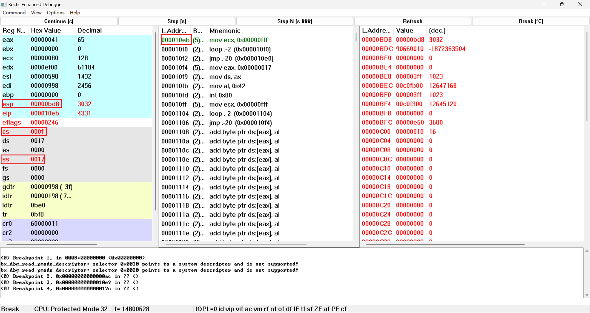
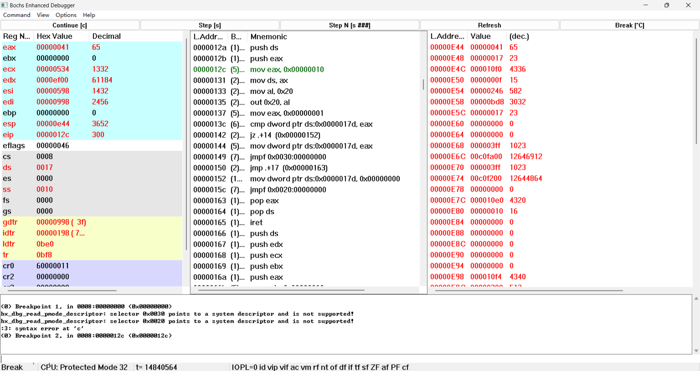
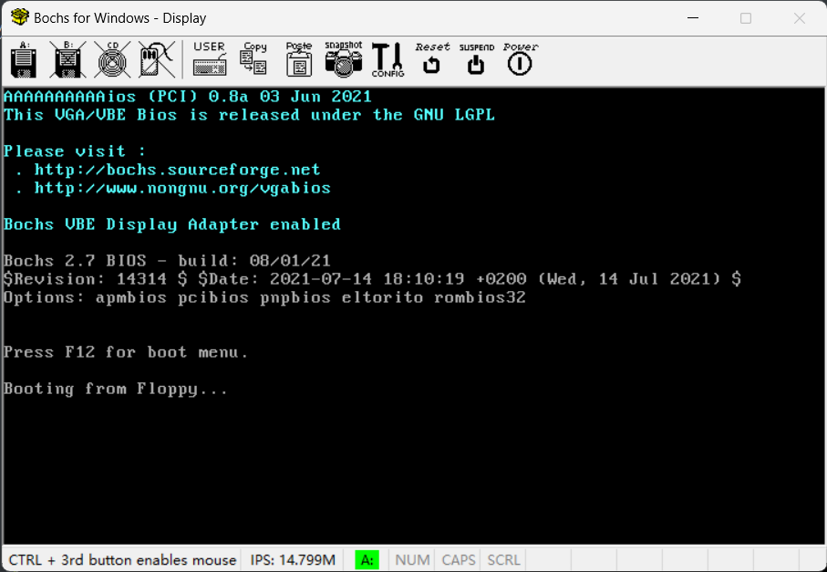
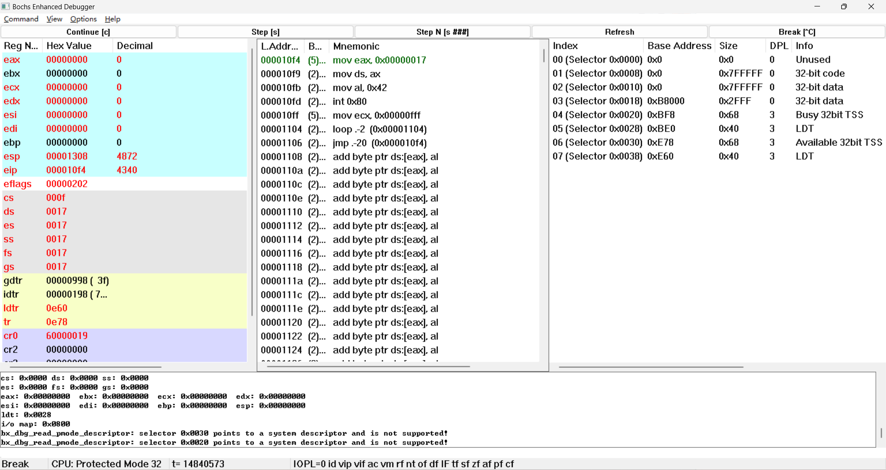
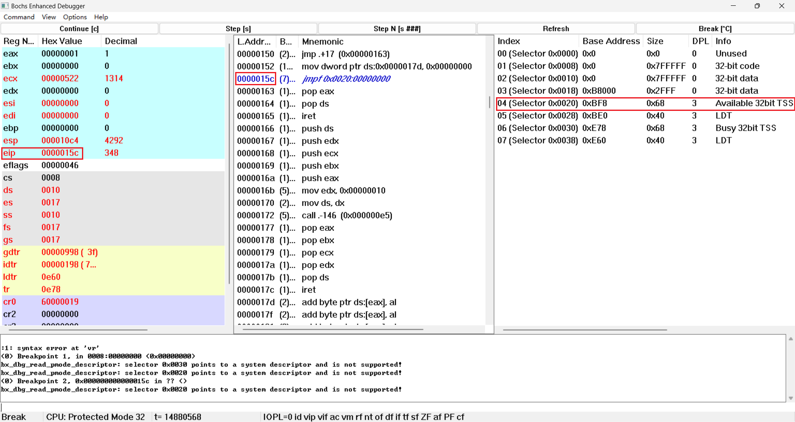
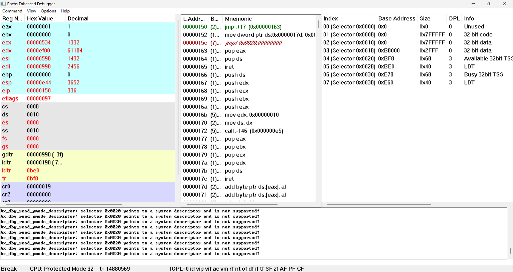

# 实验二 调试分析 Linux 0.00 多任务切换

## 1.当执行完 `system_interrupt` 函数，执行 `153` 行 `iret` 时，记录栈的变化情况。

​		将`iret`地址设为断点，执行到`iret`前，现在栈顶SS:ESP指向0x10:0x0E4C，并且可以看见内核栈栈顶的中断返回地址0x0F:0x10EB 和用户栈栈顶地址0x17:0x0BD8：

​		执行 `153` 行 `iret` 后，栈顶SS:ESP被切换到了0x17:0x0BD8，并且中断返回到了0x0F:0x10EB处。

​      栈指针（ESP）会增加 12 个字节，指向栈顶。

## 2.当进入和退出 `system_interrupt` 时，都发生了模式切换，请总结模式切换时，特权级是如何改变的？栈切换吗？如何进行切换的？

​      当进入 system_interrupt 时，由于用户态程序使用 int 0x80 指令调用系统服务，因此发生了从用户态（特权级3）到内核态（特权级0）的模式切换。

​      这时，CPU 会自动从 TSS 中加载内核态的 SS 和 ESP，并压入用户态的 SS、ESP、EFLAGS、CS 和 EIP 到内核栈中。

​      因此，栈也发生了切换，从用户栈切换到内核栈。

​      当退出 system_interrupt 时，由于内核态程序使用 iret 指令返回用户态程序，因此发生了从内核态（特权级0）到用户态（特权级3）的模式切换。

​      这时，CPU 会自动从内核栈中弹出用户态的 EIP、CS、EFLAGS、ESP 和 SS，并加载到相应的寄存器中。

​      因此，栈也发生了切换，从内核栈切换到用户栈。

### 3.当时钟中断发生，进入到 `timer_interrupt` 程序，请详细记录从任务 `0` 切换到任务 `1` 的过程。

​		时钟中断处理程序`timer_interrupt`的入口地址0x0000012C处的指令“mov eax,0x00000010”处插入断点，执行至此条指令之前。

​		此时第一次执行的任务0已经打印出了几个A，但是任务1还未执行过，还没有打印出来B：

​		之后逐步运行到处理器将要执行位于0x08:0x0149处的远转移指令“jmpf 0x30:0”。这条远转移指令意图将一个TSS 选择子装入CS。这条指令的选择子是0x30，GDT表中0x30是一个还未执行的TSS选择子。

​		输入调试命令“info tss”，看一下任务切换前的TSS：

​		执行之后寄存器变化：

​		现在已经切换到任务1，由于任务1是第一次执行，直接跳转到了用户程序task1的入口处。可以发现相比于前面，各个寄存器的值发生了很大变化。然后再查看现在的TSS：

​		TSS发生了改变，并且现在各个寄存器的值和TSS里的各个字段是一致的，任务切换时会根据TSS的各个字段修改寄存器。

## 4.又过了 `10ms` ，从任务`1`切换回到任务 `0` ，整个流程是怎样的？ `TSS` 是如何变化的？各个寄存器的值是如何变化的？

​		在时钟中断处理程序入口处设置断点，运行到下一次时钟中断发生为止。查看GDT，0x20是另一个TSS选择子。

​		查看当前的TSS：

​		第二次任务切换后，由于第一次任务切换时将寄存器现场保存到了TSS0里，因此将TSS0切换回来后，CS:EIP 会指向第一次任务切换的下一条地址，也就是0x08:0x0150。

​		查看当前TSS，显示CS:EIP确实是0x08:0x0150。

## 5.请详细总结任务切换的过程。

在 Linux 0.00 中，任务切换是一个复杂的过程，涉及到多个组件和机制。以下是任务切换的详细总结：

1. **时钟中断触发**：当时钟中断发生时，CPU 会自动保存当前任务的 CS、EIP 和 EFLAGS 到内核栈中。
2. **保存寄存器状态**：时钟中断处理程序（如 timer_interrupt）会保存当前任务的其他寄存器（如 DS、ES、FS、GS、EDI、ESI、EBP、EBX、EDX、ECX 和 EAX）到内核栈中。
3. **更新 TSS**：时钟中断处理程序会调用 save_tss 函数，将当前任务的 SS 和 ESP 保存到 TSS 中。
4. **选择下一个任务**：时钟中断处理程序会调用 change_task 函数来切换任务。该函数会检查当前任务号，并将其加一取模得到下一个任务号。
5. **修改 GDT 描述符**：change_task 函数会修改全局描述符表（GDT）中的 TSS 描述符和局部描述符表（LDT）描述符，使其指向下一个任务的 TSS 和 LDT。
6. **跳转到新任务**：change_task 函数使用 ljmp 指令跳转到下一个任务的代码段，并加载新的 TSS 寄存器值。
7. **恢复寄存器状态**：CPU 在执行 ljmp 指令时，会自动从新的 TSS 中加载下一个任务的 EFLAGS、EIP、CS、SS 和 ESP，并从内核栈中弹出下一个任务的其他寄存器。
8. **开始执行新任务**：此时，CPU 开始执行下一个任务。

这个过程涉及到了 CPU 的一些特殊机制，如 TSS、LDT、GDT、IDT 和中断门等。每次任务切换都会涉及到寄存器状态的保存和恢复，以及特权级和栈的切换。这确保了多任务环境中各个任务能够独立运行，而不会相互干扰。
