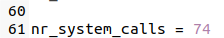
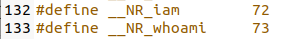
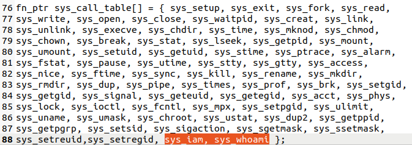
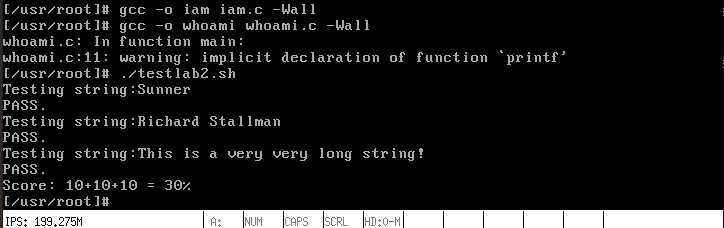

# 实验四——系统调用

1. 首先在`kernel/system_call.s`中把系统调用的总数从`72`改为`74`：



​		在`include/unistd.h`中添加`iam`和`whoami`系统调用编号的宏定义：



2. 在`include/linux/sys.h`中的系统调用函数表中增加系统调用条目：


​		并在最后的`sys_call_table`中按顺序加入添加的系统调用的条目：



3. 修改`kernel`文件夹中的`Makefile`，添加对应的依赖项：


​		并在`Dependencies`中增加`who.s`和`who.o`：


4. 在`kernel`目录中增加`who.c`这个文件，使用`get_fs_byte`和`put_fs_byte`将用户空间中的数据拷贝到内核空间中。因为代码运行在内核空间中，而`name`在用户空间，涉及到取用`name`的操作都需要通过`get_fs_byte`和`put_fs_byte`来进行：

   ```c
   #include <string.h>
   #include <errno.h>
   #include <asm/segment.h>
   
   char __username[24]; //23个字符 +'\0' = 24
   int __length;
   
   int sys_iam(const char * name)
   {
   	int name_len = 0;
   	while (get_fs_byte(&name[name_len]) != '\0')
   		++name_len;
   	if(name_len > 23)
   		return -(EINVAL);
   	int i = 0;
   	for(; i < name_len; ++i)
   		__username[i] = get_fs_byte(&name[i]);
   
   	__username[i] = '\0';
   	__length = name_len;
   	return __length;
   }
   
   int sys_whoami(char* name, unsigned int size)
   { 	
   	if (size < __length)
   		return -(EINVAL);
   	int i = 0;
   	for(; i<__length; ++i)
   	{
   		put_fs_byte(__username[i],&name[i]);
   	}
   	return __length;
   }
   ```

5. 最后在`Linux0.11`目录下`make all`后执行`run`，测试编写的结果：

   这里先使用`sudo ./mount-hdc`命令将事先编写好的`iam.c` `whoami.c` 以及测试脚本复制到`hdc/usr/root`文件夹下，运行虚拟机后使用`ls`命令可以查看当前目录下的文件

   其中`iam.c` 和`whoami.c` 内容如下：

   ```c
   #include <errno.h>
   #define __LIBRARY__
   #include <unistd.h>
   #include <stdio.h>
   
   _syscall1(int, iam, const char*, name);
   
   int main(int argc,char ** argv)
   {
   	iam(argv[1]);
   	return 0;
   }
   ```

   ```c
   #include <errno.h>
   #define __LIBRARY__
   #include <unistd.h>
   
   _syscall2(int, whoami,char*,name,unsigned int,size);
   
   int main()
   {
   	char s[24];
   	whoami(s,24);
   	printf("%s",s);
   	return 0;
   }
   ```

   编译执行`testlab2.c`，结果如下：


​		执行`testlab2.sh`，结果如下：



​		获得了全部的80%的分数。

#### 回答问题

- ###### **从 `Linux 0.11` 现在的机制看，它的系统调用最多能传递几个参数？**

  从目前的Linux 0.11的实现机制来看，最多只能传递三个参数，因为内核中只定义了`_syscall1`、`_syscall2`、`_syscall3`三个宏。使用`eax`、`ebx`、`ecx`、`edx`四个寄存器，其中`eax`用来传递中断号，只有其他三个寄存器能够用来传递参数。

- ###### **你能想出办法来扩大这个限制吗？**

  将需要传递的多个参数保存在有特定结构的区间中，并将该用户态地址空间的这个区间的首地址作为一个参数传递给系统调用。最后通过寄存器间接寻址方式便可以访问所有参数。

- ###### **用文字简要描述向 `Linux 0.11` 添加一个系统调用 `foo()` 的步骤。**

  * 首先，修改`include/linux/sys.h`在`sys_call_table`数组最后加入`sys_foo`，并仿照上面给出其他系统调用格式加上`extern rettype sys_foo();`
  * 修改`include/unistd.h`: 加入`#define __NR_foo num`，num为接下来使用的系统调用号
  * 修改`kernel/system_call.s`中`nr_system_calls = num`，num为在原值上加`1`
  * 在`kernel`中添加 `foo.c `。若需要支持内核态与用户态数据交互则包含`include/asm/segment.h`，在`foo.c`实现系统调用`sys_foo()`
  * 修改`kernel`的`Makefile`，将`foo.c`与内核其它代码编译链接到一起
  * 系统调用用户界面要添加`#define __LIBRARY__` `#include <unistd.h>`和`_syscallN`宏展开系统调用，提供用户态的系统调用接口