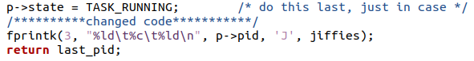
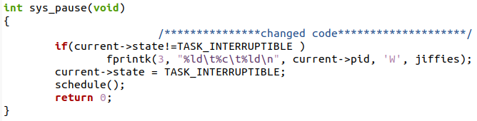
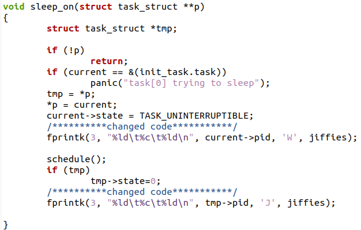
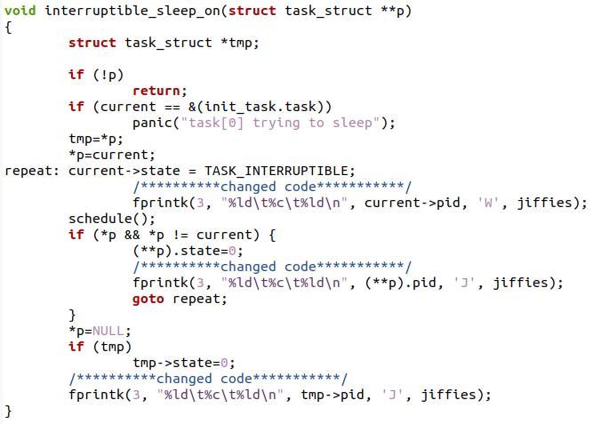
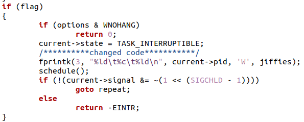
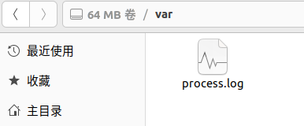
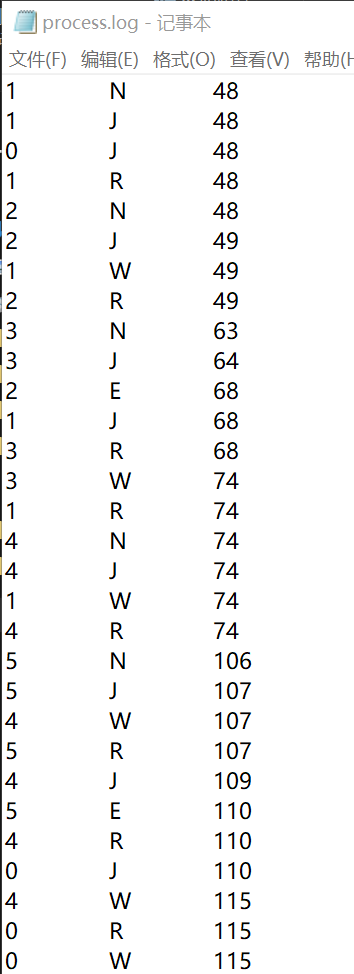
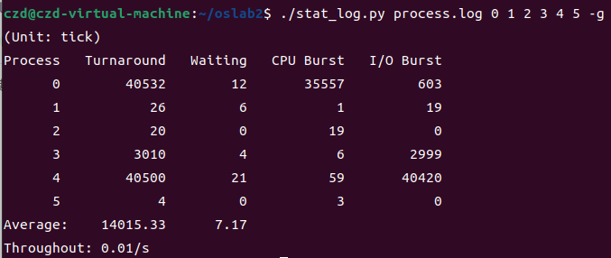
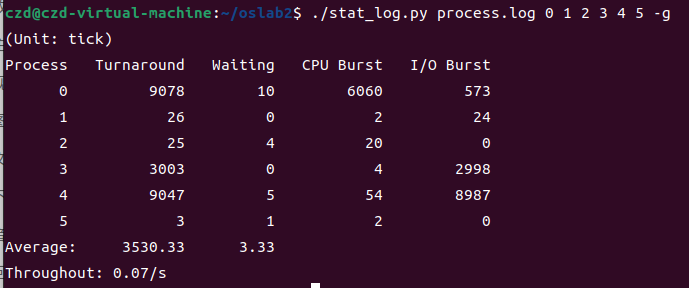

### 实验五——进程运行轨迹的跟踪与统计

#### 一、实验内容

#### 1.修改`init/main.c`

操作系统启动后在每个进程发生状态切换的时候向该文件写入一条记录，因此先要打开 `/var/process.log`，此时在内核态写入文件不能使用系统调用。

​		在内核启动时就打开 log 文件。内核的入口是 `init/main.c` 中的 `main()`。`move_to_user_mode()` 切换到用户模式，该代码在进程 `0` 中运行，进程 `1` 执行 `init()` 。

​		文件描述符 `0` 、`1` 、`2` 分别对应 `stdin` 、`stdout` 、`stderr` 。把 `log` 文件的描述符关联到 `3` 。在文件系统初始化，描述符 `0` 、`1` 和 `2` 关联之后，才能打开 `log` 文件，开始记录进程的运行轨迹。为了能尽早访问 `log` 文件，要让上述工作在进程 `0` 中就完成。所以把这一段代码从 `init()` 移动到 `main()` 中，放在 `move_to_user_mode()` 之后（系统调用必须在用户态执行，不能再靠前），同时加上打开 `log` 文件的代码。

​		修改后的代码如下：


#### 2.内核程序向 `log` 写入

`log` 文件将被用来记录进程的状态转移轨迹。所有的状态转移都是在内核进行的。在内核状态下，`write()` 功能失效，其原理等同于不能在内核状态调用 `printf()`，只能调用 `printk()`。相关代码已经在指导网站给出，复制到`kernel/printk.c`文件中即可。

#### 3.修改内核文件以跟踪进程状态

+ 在`kernel/fork.c`中创建新进程，这个文件记录 `N` 和 `J` 。

  首先新建进程初始化 tss 为寄存器映像前，输出为新建态：


​	在 `copy_process()` 的结尾，子进程的状态设置为就绪，输出为就绪态：



​	`copy_process()` 内部，`p->tss.eax = 0;` 因为系统调的返回值在 `%eax` 寄存器内，所以子进程 `fork()` 返回 `0` 。

+ 修改`kernel/sched.c`

  在`schedule()`函数中增加中断睡眠唤醒进程`->`就绪态和进程时间片到时`->`就绪态的代码：

  

  

  `main()` 函数中，若系统无任何额外的进程工作，则进程 `0` 会不断的调用 `pause()` 阻塞自己，也就是内核执行 `sys_pause()` 。当这种情况发生时，无需向 `log` 记录。在`sys_pause()`函数中修改：

  
  
  修改`sleep_on()`函数，分别加入`当前进程运行`->`不可中断睡眠`和`原等待队列链的下一个睡眠进程`->`唤醒`
  
  
  
  `interruptible_sleep_on()` 与 `sleep_on()` 类似。不同之处在于只有在被唤醒进程与阻塞队列队首进程恰好相同时，才可以将该进程变为就绪态。
  
  
  
  `wake_up()` 负责将阻塞队列的队首进程唤醒
  
  
  
+ 修改`kernel/exit.c`

  `kernel/exit.c` 是进程退出及父进程等待的代码，在进程状态发生转换的时候向 `log` 写入。其中修改的函数包括`do_exit()`和`sys_waitpid()`

  

  

#### 4.编写`process.c`

`process.c` 运行在用户态，路径为 `hdc/usr/root/process.c` 。

```c
#include <stdio.h>
#include <stdlib.h>
#include <unistd.h>
#include <time.h>
#include <sys/times.h>
#define HZ	100

void cpuio_bound(int last, int cpu_time, int io_time);

int main(int argc, char * argv[])
{
	pid_t fd1, fd2;
	int fd;
	
	printf("parent pid = [%d]\n", getpid());

	fd1 = fork();
	if(fd1 == 0)
	{
		printf("[%d] is running\n", getpid());
		cpuio_bound(10, 1, 0);
		exit(0);
	}

	fd2 = fork();
	if(fd2 == 0)
	{
		printf("[%d] is running\n", getpid());
		cpuio_bound(10, 1, 0);
		exit(0);
	}

	fd = wait(NULL);
	printf("[%d] exit\n",fd);

	fd = wait(NULL);
	printf("[%d] exit\n",fd);

	return 0;
}

void cpuio_bound(int last, int cpu_time, int io_time)
{
	struct tms start_time, current_time;
	clock_t utime, stime;
	int sleep_time;

	while (last > 0)
	{
		/* CPU Burst */
		times(&start_time);
		/* 只有t.tms_utime才是真正的CPU时间。*/
		do
		{
			times(&current_time);
			utime = current_time.tms_utime - start_time.tms_utime;
			stime = current_time.tms_stime - start_time.tms_stime;
		} while ( ( (utime + stime) / HZ )  < cpu_time );
		last -= cpu_time;

		if (last <= 0 )
			break;
		/* IO Burst */
		/* 用sleep(1)模拟1秒钟的I/O操作 */
		sleep_time=0;
		while (sleep_time < io_time)
		{
			sleep(1);
			sleep_time++;
		}
		last -= sleep_time;
	}
}
```

在Bochs下运行得到结果：


在`var`文件夹下查看`process.log`:



`process.log`部分内容如下（复制到windows下）：



可以看到五种状态都能输出。

#### 二、回答问题及修改时间片：

##### 1.结合自己的体会，谈谈从程序设计者的角度看，单进程编程和多进程编程最大的区别是什么？

从程序设计者的角度来看，单进程编程和多进程编程的最大区别在于并发性和资源共享。

1. 并发性：在单进程编程中，程序是按照顺序逐行执行的，一次只能执行一个任务。这意味着如果程序中存在耗时的操作，整个程序的执行会被阻塞，直到该操作完成。相反，多进程编程允许同时执行多个任务，每个任务在独立的进程中执行。这样可以提高程序的并发性，多个任务可以并行执行，不会相互阻塞。
2. 资源共享：在单进程编程中，程序所有的数据和资源都是共享的，任何一个部分对共享资源的修改都会影响其他部分。这可能导致数据竞争和并发访问问题。多进程编程通过将任务分割到独立的进程中，每个进程都有自己的内存空间，因此资源共享的问题较少。不同的进程可以通过进程间通信（IPC）机制来进行数据交换和通信。

##### 2.你是如何修改时间片的？仅针对样本程序建立的进程，在修改时间片前后， `log` 文件的统计结果（不包括Graphic）都是什么样？结合你的修改分析一下为什么会这样变化，或者为什么没变化？

Linux0.11的时间片算法在`kernel/sche.c`文件中，具体位置如下：

```c
for (p = &LAST_TASK; p > &FIRST_TASK; --p) {
    if (*p) {
        (*p)->counter = ((*p)->counter >> 1) + (*p)->priority;
        // 在这里进行时间片的修改
    }
}
```

默认情况下，代码将当前进程的 `counter` 值右移一位并加上进程的优先级，生成新的时间片。

这里修改为将 `counter` 值右移两位，这样进程将获得更长的时间片：

```c
(*p)->counter = ((*p)->counter >> 2) + (*p)->priority;
```

修改前：



修改后：



可以看到进程获得更长的时间片后平均完成时间（周转时间）和等待时间都减小了。当进程的时间片增加时，每个进程可以连续运行更长的时间，因此等待时间可能会减少。

