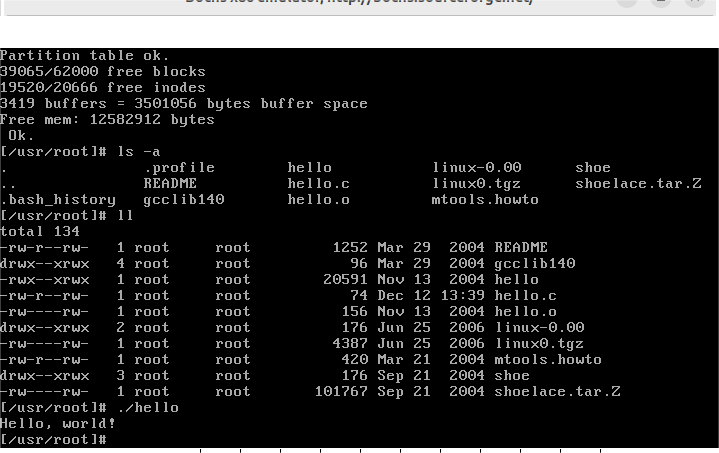
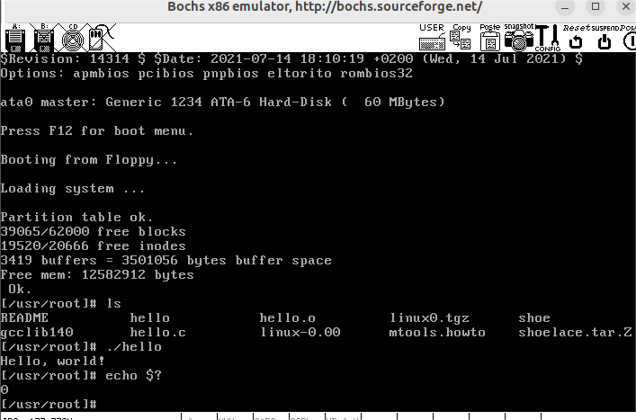

# 附加实验

## Hello World程序

Hello World程序是计算机编程语言中的一个简单程序，它会在屏幕上输出“Hello, World!”字符串。这个程序通常是初学者学习编程语言的第一步，它可以帮助初学者了解编程语言的基本语法。

Hello World程序的具体实现方式因编程语言而异。在C语言中，Hello World程序可以用以下代码实现：

```c
#include <stdio.h>

int main() {
  printf("Hello, World!\n");
  return 0;
}

```

Hello World程序虽然简单，但它具有重要的意义。它可以帮助初学者了解编程语言的基本语法，并掌握编程的基本思想。下面我们将从从OS视角漫谈Hello World

## 创建进程

在`linux 0.11`中，对于每个进程，都定义了它的任务结构：该结构包含了进程的所有信息，包括：

-  进程标识符（pid）：每个进程都有一个唯一的标识符，用于区分不同的进程。

- 进程状态：进程可以处于以下状态之一：就绪、运行、阻塞、僵尸。

-  进程堆栈：进程执行代码使用的堆栈。

-  进程打开的文件：进程打开的文件列表。

-  进程的地址空间：进程使用的地址空间。

-  进程的寄存器：进程执行时使用的寄存器。

任务结构的具体定义如下：

```c
struct task_struct {
/* these are hardcoded - don't touch */
	long state;	/* -1 unrunnable, 0 runnable, >0 stopped */
	long counter;
	long priority;
	long signal;
	struct sigaction sigaction[32];
	long blocked;	/* bitmap of masked signals */
/* various fields */
	int exit_code;
	unsigned long start_code,end_code,end_data,brk,start_stack;
	long pid,father,pgrp,session,leader;
	unsigned short uid,euid,suid;
	unsigned short gid,egid,sgid;
	long alarm;
	long utime,stime,cutime,cstime,start_time;
	unsigned short used_math;
/* file system info */
	int tty;		/* -1 if no tty, so it must be signed */
	unsigned short umask;
	struct m_inode * pwd;
	struct m_inode * root;
	struct m_inode * executable;
	unsigned long close_on_exec;
	struct file * filp[NR_OPEN];
/* ldt for this task 0 - zero 1 - cs 2 - ds&ss */
	struct desc_struct ldt[3];
/* tss for this task */
	struct tss_struct tss;
};
```

任务结构位于内核空间，由内核维护。当创建一个新进程时，内核会分配一个任务结构，并将该结构中的相关信息初始化。当进程终止时，内核会释放该任务结构。
任务结构是Linux内核中一个重要的结构，它是进程管理的基础。通过任务结构，内核可以对进程进行管理，例如创建、终止、调度等。

首先，我们在shell中输入`./hello`换行运行，此时，用户通过键盘输入信息，存储在指定的字符缓冲队列上。该缓冲队列上的内容，就是`tty0`文件的内容，shell进程会不断读取缓冲队列上的数据信息。

用户通过键盘下达指令，将产生键盘中断，中断程序会将字符信息存储在缓冲队列上，并给shell进程发信号。信号将导致shell进程被设置为就绪状态，即被唤醒。唤醒后的shell继续从缓冲队列中读取数据信息并处理。

具体来说，当用户按下键盘上的按键时，键盘控制器会产生一个键盘中断。键盘中断程序会将键盘按键的编码存储在缓冲队列上。缓冲队列是内核中的一块内存区域，用于存储来自设备的输入数据。

当缓冲队列中的数据量达到一定阈值时，中断程序会给shell进程发送一个信号。信号是内核用于通知进程发生了某些事件的机制。

shell进程收到信号后，会从内核中获取信号的相关信息。如果信号是键盘中断产生的信号，那么shell进程就会从缓冲队列中读取数据信息。

读取到数据信息后，shell进程会根据数据信息的类型进行处理。如果数据信息是一个指令，那么shell进程就会执行该指令。

**以下是创建进程的基本步骤：**

- **用户空间调用：**进程的创建在用户空间程序，通过调用`fork`系统调用。
- **系统调用处理：**当用户程序调用`fork`时，系统调用处理程序`system_call.s`被触发，将控制权转移到内核空间。
- **内核空间处理：**内核空间处理程序会为新进程分配一个任务结构，并将该结构中的相关信息初始化。然后，内核会将控制权转移到新进程。

具体来说，当用户程序调用`fork`时，系统调用处理程序`system_call.s`会将控制权转移到内核空间。内核空间处理程序会为新进程分配一个任务结构，并将该结构中的相关信息初始化。初始化的信息包括：

- 进程标识符（pid）：每个进程都有一个唯一的标识符，用于区分不同的进程。
- 进程状态：进程可以处于以下状态之一：就绪、运行、阻塞、僵尸。
- 进程堆栈：进程执行代码使用的堆栈。
- 进程打开的文件：进程打开的文件列表。
- 进程的地址空间：进程使用的地址空间。
- 进程的寄存器：进程执行时使用的寄存器。

初始化完成后，内核会将控制权转移到新进程。新进程的执行状态与父进程相同，但其进程标识符不同。

```asm
call sys_call_table(,%eax,4)    # 间接调用指定功能C函数，这里调用sys_fork
```

其中，sys_call_table的定义在`/include/linux/sys.h`中。sys_call_table是一个函数指针数组，用于存储系统调用处理程序的地址。

sys_call_table的定义如下：

```c
fn_ptr sys_call_table[] = { sys_setup, sys_exit, sys_fork, sys_read,
sys_write, sys_open, sys_close, sys_waitpid, sys_creat, sys_link,
sys_unlink, sys_execve, sys_chdir, sys_time, sys_mknod, sys_chmod,
sys_chown, sys_break, sys_stat, sys_lseek, sys_getpid, sys_mount,
sys_umount, sys_setuid, sys_getuid, sys_stime, sys_ptrace, sys_alarm,
sys_fstat, sys_pause, sys_utime, sys_stty, sys_gtty, sys_access,
sys_nice, sys_ftime, sys_sync, sys_kill, sys_rename, sys_mkdir,
sys_rmdir, sys_dup, sys_pipe, sys_times, sys_prof, sys_brk, sys_setgid,
sys_getgid, sys_signal, sys_geteuid, sys_getegid, sys_acct, sys_phys,
sys_lock, sys_ioctl, sys_fcntl, sys_mpx, sys_setpgid, sys_ulimit,
sys_uname, sys_umask, sys_chroot, sys_ustat, sys_dup2, sys_getppid,
sys_getpgrp, sys_setsid, sys_sigaction, sys_sgetmask, sys_ssetmask,
sys_setreuid,sys_setregid };
```

sys_call_table的长度由宏`NR_syscalls`定义，表示系统调用的总数。当用户程序调用系统调用时，内核会根据系统调用号找到对应的系统调用处理程序，并将控制权转移到该处理程序。sys_call_table的定义在Linux内核的编译过程中生成。在编译时，内核会根据系统调用的定义，生成sys_call_table数组。

**内核空间处理：**内核空间的fork系统调用处理程序执行以下核心代码和关键步骤：

1. 检查权限：检查用户是否有权限创建新进程。
2. 分配任务结构：为新进程分配一个任务结构。
3. 初始化任务结构：初始化新进程的任务结构。
4. 复制父进程的地址空间：将父进程的地址空间复制到新进程的地址空间。
5. 复制父进程的打开文件：将父进程打开的文件复制到新进程的打开文件列表。
6. 将控制权转移到新进程：将控制权转移到新进程。

```asm
.align 2
sys_fork:
	call find_empty_process
	testl %eax,%eax             # 在eax中返回进程号pid。若返回负数则退出。
	js 1f
	push %gs
	pushl %esi
	pushl %edi
	pushl %ebp
	pushl %eax
	call copy_process
	addl $20,%esp               # 丢弃这里所有压栈内容。
1:	ret
```

**1. 分配任务结构**

在find_empty_process函数中，内核会从任务数组中查找一个空闲的任务结构。如果找到空闲的任务结构，则将其返回给copy_process函数。如果没有找到空闲的任务结构，则内核会创建一个新的任务结构。

**2. 初始化任务结构**

在copy_process函数中，内核会初始化新进程的任务结构。初始化的信息包括：

- 进程标识符（pid）：每个进程都有一个唯一的标识符，用于区分不同的进程。
- 进程状态：进程可以处于以下状态之一：就绪、运行、阻塞、僵尸。
- 进程堆栈：进程执行代码使用的堆栈。
- 进程打开的文件：进程打开的文件列表。
- 进程的地址空间：进程使用的地址空间。
- 进程的寄存器：进程执行时使用的寄存器。

**3. 复制地址空间**

在copy_mem函数中，内核会将父进程的地址空间复制到新进程的地址空间。地址空间是进程用于存储代码、数据和堆栈的内存区域。

地址空间复制通常是通过使用内核的页表来完成的。页表是内核用于映射物理内存到虚拟内存的结构。

在Linux内核中，地址空间复制通常是通过写时复制（Copy-On-Write）实现的。写时复制是一种优化技术，它允许多个进程共享相同的页面，直到某个进程尝试修改该页面时，才真正复制该页面。

**4. 复制文件描述符**

在copy_mem函数中，内核会将父进程的文件描述符表复制到新进程的文件描述符表。文件描述符表是进程用于存储打开的文件的列表。

**5. 设置状态**

内核会将新进程的状态设置为就绪，这意味着新进程可以被调度程序schedule执行。

**6. 返回用户空间**

内核完成创建新进程的操作后，控制权返回到用户空间。fork系统调用在原始进程中返回新进程的PID，而在新进程中返回0。

**结论**

通过fork系统调用，父进程创建了一个与自己几乎完全相同的子进程。子进程继承了父进程的状态，并且两者在创建时共享相同的内存映像。通过COW机制，直到某个进程尝试修改它们的内存空间时，才会真正复制共享的页面，以确保效率和内存利用率。

## 内存管理

在`hello`程序运行必须要加载入内存才可以正常运行。这是因为程序的执行代码和数据存储在内存中，程序的执行需要借助 CPU 来执行，而 CPU 可以直接访问内存中的代码和数据。

**分配进程地址空间：**在`/kernel/fork.c`中的`copy_mem`函数中，涉及到分配新进程的地址空间。父子进程最初共享相同的虚拟地址空间，但实际的内存页并没有立即复制。

具体来说，内核会将父进程的页表复制到新进程的页表中。页表是内核用于映射虚拟地址到物理地址的结构。在复制页表时，内核会使用写时复制（Copy-On-Write）机制。写时复制是一种优化技术，它允许多个进程共享相同的页面，直到某个进程尝试修改该页面时，才真正复制该页面。

因此，在fork系统调用执行完毕后，父子进程的虚拟地址空间是完全相同的。但是，实际的内存页只有父进程真正使用的页面被分配了物理内存，而新进程使用的页面仍然是引用父进程的物理内存。只有当新进程尝试修改这些页面时，内核才会真正复制这些页面。

```c
int copy_mem(int nr,struct task_struct * p)
{
	unsigned long old_data_base,new_data_base,data_limit;
	unsigned long old_code_base,new_code_base,code_limit;
	code_limit=get_limit(0x0f);
	data_limit=get_limit(0x17);
	old_code_base = get_base(current->ldt[1]);
	old_data_base = get_base(current->ldt[2]);
	if (old_data_base != old_code_base)
		panic("We don't support separate I&D");
	if (data_limit < code_limit)
		panic("Bad data_limit");
	new_data_base = new_code_base = nr * 0x4000000;
	p->start_code = new_code_base;
	set_base(p->ldt[1],new_code_base);
	set_base(p->ldt[2],new_data_base);
	if (copy_page_tables(old_data_base,new_data_base,data_limit)) {
		printk("free_page_tables: from copy_mem\n");
		free_page_tables(new_data_base,data_limit);
		return -ENOMEM;
	}
	return 0;
}
```

**写时复制（Copy-On-Write）：** 
写时复制（Copy-On-Write）是一种内存管理技术，它允许多个进程共享相同的页面，直到某个进程尝试修改该页面时，才真正复制该页面。
写时复制机制通过在页表中标记页面为只读来实现。当父子进程中有一个尝试修改它们的虚拟地址空间时，内核会检查页表中相应的页面是否标记为只读。如果是，则内核会将该页面复制到一个新的物理页面，并将页表中的相应项更新为指向新页面的地址。
写时复制机制可以有效地减少内存的使用量。例如，如果一个进程创建了多个子进程，并且这些子进程都需要使用相同的代码段，则可以使用写时复制机制来避免为每个子进程都创建一个独立的代码段。

**缺页异常处理：**

`hello`程序开始执行时，其线性地址空间对应的程序内容并未加载，也就不存在相应的页面，因此会产生一个缺页异常中断。

缺页中断处理程序是内核中的一个重要程序，它负责处理缺页异常。缺页中断处理程序的具体步骤如下：

1. 检查权限：缺页中断处理程序首先会检查进程是否有权访问该页面。如果没有权限，则会立即终止该进程。
2. 分配页面：如果进程有权访问该页面，则缺页中断处理程序会分配一个新的页面给该进程。页面分配可以通过内存管理子系统来完成。
3. 加载页面：缺页中断处理程序会将`hello`程序的一页内容加载到新分配的页面中。页面加载可以通过文件系统或网络来完成。
4. 更新页表：缺页中断处理程序会更新页表，将新分配的页面映射到相应的线性地址。
5. 恢复执行：缺页中断处理程序完成上述步骤后，会恢复进程的执行。

具体调用`/mm/page.s`程序中的`_page_fault`来处理缺页异常，在Linux内核中，缺页中断处理程序位于`/mm/page.s`程序中。`_page_fault`函数是缺页中断处理程序的入口函数。`_page_fault`函数会调用上述步骤来处理缺页异常。

具体实现过程为：

```asm
.globl page_fault

page_fault:
	xchgl %eax,(%esp)
	pushl %ecx
	pushl %edx
	push %ds
	push %es
	push %fs
	movl $0x10,%edx
	mov %dx,%ds
	mov %dx,%es
	mov %dx,%fs
	movl %cr2,%edx
	pushl %edx
	pushl %eax
	testl $1,%eax
	jne 1f
	call do_no_page
	jmp 2f
1:	call do_wp_page
2:	addl $8,%esp
	pop %fs
	pop %es
	pop %ds
	popl %edx
	popl %ecx
	popl %eax
	iret

```

**1. 缺页处理**

当进程在执行时，需要访问一个虚拟地址，但该虚拟地址对应的物理页面尚未分配，则会触发缺页异常。内核会通过`do_no_page()`函数来处理缺页异常。

`do_no_page()`函数会首先尝试与已加载的相同文件进行页面共享。如果该文件已经加载到内存中，并且该页面已经被其他进程共享，则内核会将该页面映射到新进程的地址空间中。

如果页面无法共享，则内核会从相应文件中读入所缺的数据页面到指定线性地址处。如果该页面是可写的，则内核会将该页面映射到新进程的地址空间中。如果该页面是只读的，则内核会将该页面映射到新进程的地址空间中，并设置该页面的属性为只读。

**2. 写保护页处理**

当进程试图写入一个只读页面时，会触发写保护异常。内核会通过`do_wp_page()`函数来处理写保护异常。

`do_wp_page()`函数会首先尝试将该页面从只读改为可写。如果该页面是共享的，则内核会将该页面复制一份，并将复制后的页面设置为可写。如果该页面是私有的，则内核会直接将该页面设置为可写。

如果将该页面从只读改为可写失败，则内核会终止进程。

**3. 页面映射**

在载入`hello`程序后，内核会将`hello`程序的代码、数据和堆栈映射到`hello`进程的线性地址空间内。

内核会使用页目录表来管理页表的地址。页目录表是一个二维数组，每个元素对应一个页表。

每个页表又是一个二维数组，每个元素对应一个页。

内核会将页表中的页映射到物理内存中。

**总结**

通过`do_no_page()`函数和`do_wp_page()`函数，内核能够有效地处理缺页异常和写保护异常。通过页面映射，内核能够将程序的虚拟地址空间映射到物理内存中，从而实现进程的内存管理。

**用户态和内核态的内存切换：**在`hello`程序执行过程中，会执行`printf("Hello, world!\n")`，在此过程中会存在用户态和内核态之间的互相切换。

用户态和内核态是操作系统中两个不同的执行模式。用户态是指进程在自己的地址空间中执行代码，可以访问自己的数据和文件，但不能直接访问内核的资源。内核态是指操作系统在自己的地址空间中执行代码，可以访问所有系统资源。

在`hello`程序中，`printf()`函数是一个系统调用。系统调用是指进程向操作系统发出请求，让操作系统执行某个操作。当进程执行`printf()`函数时，它会将控制权转移到内核态。在内核态中，操作系统会执行`printf()`函数的代码，并将输出结果写入到标准输出。

在用户态和内核态之间切换时，需要进行内存切换。内存切换是指将进程的地址空间切换到内核态或用户态。

在`printf()`函数执行期间，进程的地址空间会从用户态切换到内核态。在内核态中，进程的地址空间会被切换到内核的地址空间。

**在内存切换过程中，程序的代码段、数据段、栈段都要进行切换。**

代码段：代码段包含程序的执行代码。在内核态中，进程会执行内核的代码，因此需要将用户态的代码段切换到内核态的代码段。

数据段：数据段包含程序的数据。在内核态中，进程可以访问自己的数据，但不能访问其他进程的数据。因此，需要将用户态的数据段切换到内核态的数据段。

栈段：栈段用于存储函数调用时的参数和返回地址。在内核态中，进程的栈段与用户态的栈段是不同的。因此，需要将用户态的栈段切换到内核态的栈段。

具体来说，在`printf()`函数执行期间，内存切换的步骤如下：

1. 操作系统将进程的状态设置为`内核态`。
2. 操作系统将进程的代码段切换到内核态的代码段。
3. 操作系统将进程的数据段切换到内核态的数据段。
4. 操作系统将进程的栈段切换到内核态的栈段。
5. 操作系统开始执行`printf()`函数的代码。

在`printf()`函数执行完成后，内存切换的步骤如下：

1. 操作系统将进程的状态设置为`用户态`。
2. 操作系统将进程的代码段切换到用户态的代码段。
3. 操作系统将进程的数据段切换到用户态的数据段。
4. 操作系统将进程的栈段切换到用户态的栈段。
5. 操作系统将控制权返回给用户态。

## 文件系统

文件系统包含引导块、超级块、i-node位图、逻辑块位图、i节点与数据区等：


**引导块**：位于文件系统的最开始，用于引导系统启动。引导块通常包含以下信息：

- 文件系统类型
- 文件系统版本
- 文件系统大小
- 文件系统的初始化信息

**超级块**：位于文件系统的第二块，用于管理文件系统的整体信息。超级块通常包含以下信息：

- 文件系统的总大小
- 文件系统的块大小
- 文件系统的块数
- 文件系统的inode数
- 文件系统的空闲块数
- 文件系统的inode位图的位置
- 文件系统的逻辑块位图的位置

```c
struct super_block {
	unsigned short s_ninodes;
	unsigned short s_nzones;
	unsigned short s_imap_blocks;
	unsigned short s_zmap_blocks;
	unsigned short s_firstdatazone;
	unsigned short s_log_zone_size;
	unsigned long s_max_size;
	unsigned short s_magic;
/* These are only in memory */
	struct buffer_head * s_imap[8];
	struct buffer_head * s_zmap[8];
	unsigned short s_dev;
	struct m_inode * s_isup;
	struct m_inode * s_imount;
	unsigned long s_time;
	struct task_struct * s_wait;
	unsigned char s_lock;
	unsigned char s_rd_only;
	unsigned char s_dirt;
};
```

**i-node位图**：用于管理文件系统中的inode。inode位图中的每个位表示一个inode是否被使用。

**逻辑块位图**：用于管理文件系统中的逻辑块。逻辑块位图中的每个位表示一个逻辑块是否被使用。

**i节点**：用于描述文件系统中的文件或目录。i节点通常包含以下信息：

- 文件或目录的名称
- 文件或目录的类型
- 文件或目录的大小
- 文件或目录的创建时间
- 文件或目录的修改时间
- 文件或目录的访问时间
- 文件或目录的权限
- 文件或目录的数据区在逻辑块中的起始位置

```c
struct m_inode {
	unsigned short i_mode;
	unsigned short i_uid;
	unsigned long i_size;
	unsigned long i_mtime;
	unsigned char i_gid;
	unsigned char i_nlinks;
	unsigned short i_zone[9];
/* these are in memory also */
	struct task_struct * i_wait;
	unsigned long i_atime;
	unsigned long i_ctime;
	unsigned short i_dev;
	unsigned short i_num;
	unsigned short i_count;
	unsigned char i_lock;
	unsigned char i_dirt;
	unsigned char i_pipe;
	unsigned char i_mount;
	unsigned char i_seek;
	unsigned char i_update;
};
```

i_zone 数组是 inode 节点中用于存储文件数据块信息的数组。i_zone 数组的大小由文件系统的设计决定。

**直接盘块号**

直接盘块号是 i_zone 数组中用于存储文件的第一个 12 个数据块的号码。如果文件的数据块小于或等于 12，则直接盘块号就足以存储文件的所有数据块。

**一次间接盘块号**

一次间接盘块号是 i_zone 数组中用于存储文件的第 13 到 255 个数据块的号码。一次间接盘块号是一个 512 字节的块，其中存储了 256 个数据块号。

**二次间接盘块号**

二次间接盘块号是 i_zone 数组中用于存储文件的第 256 到 65535 个数据块的号码。二次间接盘块号是一个 512 字节的块，其中存储了 256 个一次间接盘块号。

直接盘块号可视为单级页表，一次间接盘块号可视为二级页表、二次间接盘块号可视为三级页表。具体来说，直接盘块号就像一个只有 12 个页面的页表。一次间接盘块号就像一个只有 256 个页面的页表，每个页面又包含 12 个页框号。二次间接盘块号就像一个只有 256 个页面的页表，每个页面又包含 256 个页框号。通过这种类比，我们可以很容易理解 inode 节点中 i_zone 数组的结构和原理。


当用户输入`./hello`来执行文件时，内核首先将相对路径`./hello`转换为绝对路径`/usr/root/hello`。文件系统负责提供路径解析的功能，将路径映射到相应的`inode`（索引节点）。具体来说，文件系统会按照以下步骤进行路径解析：

1. 首先，文件系统通过根节点`inode`号打开根目录，读取其文件内容，即目录下文件名->`inode`节点号映射表。
2. 然后，从该映射表中找到`usr`目录的`inode`节点号n1。
3. 接着，文件系统通过`usr`的`inode`节点号n1打开`usr`目录，读取其文件内容，即目录下文件名->`inode`节点号映射表。
4. 然后，从该映射表中找到`root`目录的`inode`节点号n2。
5. 最后，文件系统通过`root`的`inode`节点号n2打开`root`目录，读取其文件内容，即目录下文件名->`inode`节点号映射表。
6. 然后，从该映射表中找到`hello`文件的`inode`节点号n3。

查找`inode`节点主要在`/fs/namei.c`中的`open_namei`函数实现。该函数执行成功后会返回对应文件路径名的`i`节点指针。

文件系统读取`hello`文件的`inode`，了解文件的属性和存储位置。如果`hello`是一个可执行文件，文件系统会将该文件加载到内存中。加载的过程中，涉及到内存管理和地址空间分配。具体来说，文件系统会按照以下步骤将文件加载到内存中：

1. 首先，文件系统会根据`inode`节点中的存储位置信息，找到`hello`文件的物理地址。
2. 然后，文件系统会将`hello`文件的代码段和数据段映射到内存中。
3. 最后，文件系统会将`hello`文件的入口地址设置为程序计数器。

这样，内核就完成了`hello`文件的执行准备。

**数据区**：用于存储文件或目录的数据。

## 系统调用和IO

在`hello`程序执行过程中，使用了`printf`函数，`printf`函数是Linux内核中的一个标准输出函数。`printf`函数用于向标准输出设备（通常是显示器）输出字符串。`printf`函数在`/init/main.c`文件中实现，该文件是Linux内核的初始化文件。

`printf`函数在Linux内核中的作用主要有以下两个方面：

- 用于向用户显示信息，例如在启动Linux内核时，`printf`函数用于显示内核版本、启动参数等信息。
- 用于调试，例如在开发Linux内核时，可以使用`printf`函数来输出调试信息。

```c
static int printf(const char *fmt, ...)
{
	va_list args;
	int i;

	va_start(args, fmt);
	write(1,printbuf,i=vsprintf(printbuf, fmt, args));
	va_end(args);
	return i;
}
```

该函数实现了可变参数的打印功能，通过`va_start`宏将`args`字符指针指向第一个可变参数在堆栈的地址，从而可以通过`args`来访问可变参数。`va_end`宏将`va_list`可变参数列表清空，释放堆栈中分配的空间。

```c
#define __va_rounded_size(TYPE)  \
  (((sizeof (TYPE) + sizeof (int) - 1) / sizeof (int)) * sizeof (int))

#ifndef __sparc__
#define va_start(AP, LASTARG) 						\
 (AP = ((char *) &(LASTARG) + __va_rounded_size (LASTARG)))
#else
#define va_start(AP, LASTARG) 						\
 (__builtin_saveregs (),						\
  AP = ((char *) &(LASTARG) + __va_rounded_size (LASTARG)))
#endif
```

在`vsprintf`函数中，首先会初始化全局变量缓冲区`printbuf`。然后，会遍历`fmt`字符串，将每个字符按格式化要求写入`printbuf`。最后，会计算`printbuf`中字符的长度，并作为返回值。

经过上述程序的运行，我们就得到了`write()`的三个参数，分别是：

- 文件句柄：指向要写入数据的文件的句柄。
- 缓冲区字符指针：指向存储要写入数据的缓冲区的首地址。
- 字符长度：要写入数据的长度。

调用`write()`函数触发系统中断，将数据从缓冲区写入文件。

```asm
call sys_call_table(,%eax,4)    # 间接调用指定功能C函数，这里调用sys_write
```

`sys_write`函数在`/fs/read_write`中实现：

```c
int sys_write(unsigned int fd,char * buf,int count)
{
	struct file * file;
	struct m_inode * inode;
	if (fd>=NR_OPEN || count <0 || !(file=current->filp[fd]))
		return -EINVAL;
	if (!count)
		return 0;
	inode=file->f_inode;
	if (inode->i_pipe)
		return (file->f_mode&2)?write_pipe(inode,buf,count):-EIO;
	if (S_ISCHR(inode->i_mode))
		return rw_char(WRITE,inode->i_zone[0],buf,count,&file->f_pos);
	if (S_ISBLK(inode->i_mode))
		return block_write(inode->i_zone[0],&file->f_pos,buf,count);
	if (S_ISREG(inode->i_mode))
		return file_write(inode,file,buf,count);
	printk("(Write)inode->i_mode=%06o\n\r",inode->i_mode);
	return -EINVAL;
}
```

**第一步：判断函数参数的有效性**

- 检查进程文件句柄值是否大于程序最多打开文件数`NR_OPEN`。如果是，则返回出错码`EBADF`并退出。
- 检查需要写入的字节数`count`是否小于0。如果是，则返回出错码`EINVAL`并退出。
- 检查该句柄的文件结构指针是否为空。如果是，则返回出错码`EBADF`并退出。
- 检查需写入字节数`count`是否等于0。如果是，则直接返回`0`并退出。

**第二步：验证存放数据的缓冲区内存限制**

- 检查缓冲区是否有足够的空间存放`count`字节的数据。如果没有，则返回出错码`EAGAIN`并退出。

**第三步：获取文件的i节点**

- 使用`fgetinode()`函数获取文件的i节点。

**第四步：根据文件类型调用相应的写操作函数**

- 如果是管道文件，并且是写管道文件模式，则调用`write_pipe()`函数进行写管道操作。
- 如果是字符设备文件，则调用`write_char()`函数进行写字符设备操作。
- 如果是块设备文件，则调用`write_block()`函数进行块设备写操作。
- 如果是常规文件，则调用`write_file()`函数进行文件写操作。

**第五步：处理异常情况**

- 如果无法判断文件的属性，则打印节点文件属性，并返回出错码`EINVAL`并退出。

对于我们编写的`hello`程序，打印字符返回`rw_char`函数的返回值

```c
if (S_ISCHR(inode->i_mode))
	return rw_char(WRITE,inode->i_zone[0],buf,count,&file->f_pos);
```

## 执行程序

在 Linux 0.11 系统中，加载和执行一个二进制程序和 shell 脚本都是用 `do_execve()` 函数来完成。`do_execve()` 函数采用需求加载机制，即在需要时才将可执行文件的特定部分加载到内存中。

在加载二进制程序时，`do_execve()` 函数首先使用 `a.out` 格式读取可执行文件的源信息，包括程序的代码段、数据段、堆栈段等。然后，`do_execve()` 函数会根据可执行文件的源信息修改内核的页表，为程序的各个段分配内存空间。此外，`do_execve()` 函数还会修改进程的 `task_struct` 结构，包括进程的进程 ID、进程状态、进程堆栈等。最后，`do_execve()` 函数会设置程序的 `eip` 和 `esp` 寄存器，以便程序在执行时从正确的位置开始执行。

在应用程序执行前，操作系统必须知道这个应用程序的代码段、数据段需要多大，载入方式又是什么，以及应用程序的第一条指令在哪里。`Linux 0.11` 系统通过 `a.out` 格式来获取这些信息。`a.out` 格式是一种简单的二进制文件格式，它包含了应用程序的代码段、数据段、堆栈段等信息。

`Linux 0.11` 系统只支持 `a.out` 这一种执行文件格式。`ELF` 格式是目前普遍使用的执行文件格式，它提供了比 `a.out` 格式更丰富的信息，包括程序的符号表、重定位表等。`Linux 0.11` 系统不支持 `ELF` 格式，因此无法加载和执行 `ELF` 格式的可执行文件。其中，`a.out`格式文件的定义在`/include/a.out.h`中定义：

```c
struct exec {
  unsigned long a_magic;	/* Use macros N_MAGIC, etc for access */
  unsigned a_text;		/* length of text, in bytes */
  unsigned a_data;		/* length of data, in bytes */
  unsigned a_bss;		/* length of uninitialized data area for file, in bytes */
  unsigned a_syms;		/* length of symbol table data in file, in bytes */
  unsigned a_entry;		/* start address */
  unsigned a_trsize;		/* length of relocation info for text, in bytes */
  unsigned a_drsize;		/* length of relocation info for data, in bytes */
};
```

在Linux内核中，加载执行文件的过程分为以下几个步骤：

1. 从磁盘读取执行文件到内存中。
2. 将执行文件头结构的数据复制到内核中的`ex`结构中。
3. 释放执行文件在内存中的缓冲块。
4. 对`ex`结构中的执行头信息进行判断处理。

对于Linux 0.11 内核来说，它仅支持 ZMAGIC 执行文件格式。ZMAGIC 执行文件格式具有以下特点：

- 执行文件的头部包含一个 32 位魔数，值为 0x01010101。
- 执行文件的代码段从逻辑地址 0 开始执行。
- 执行文件不包含代码或数据重定位信息。

因此，对于 Linux 0.11 内核来说，如果执行文件的格式不符合 ZMAGIC 格式，或者执行文件的代码段或数据段包含重定位信息，那么内核将无法加载该执行文件。

```c
if (N_MAGIC(ex) != ZMAGIC || ex.a_trsize || ex.a_drsize ||
    ex.a_text+ex.a_data+ex.a_bss>0x3000000 ||
    inode->i_size < ex.a_text+ex.a_data+ex.a_syms+N_TXTOFF(ex)) {
	retval = -ENOEXEC;
	goto exec_error2;
}
```

此时，我们可以使用以下命令来查看`hello`的魔数：

```bash
hexdump hello
```

这将以十六进制格式显示`hello`文件的内容。魔数位于文件的开头，通常是 4 个字节长。

具体来说，`hexdump`命令将以以下格式显示文件的内容：


在`/include/a.out.h`中定义的`ZMAGIC`为0413(八进制)

```java
/* Code indicating object file or impure executable.   */
#define OMAGIC 0407
/* Code indicating pure executable.  */
#define NMAGIC 0410
/* Code indicating demand-paged executable.    */
#define ZMAGIC 0413
```

转换成十六进制正好为010b，所以`hello`程序在`linux 0.11`系统中被解析成可执行程序

由于执行文件直接使用当前进程的躯壳，因此在执行`exec()`系统调用时，我们需要做以下工作：

- **释放当前进程占用的系统资源。**这包括关闭指定的已打开文件、释放占用的页表和内存页面等。

  ```
  * 关闭指定的已打开文件时，需要调用`close()`系统调用。
  * 释放占用的页表和内存页面时，需要调用`free_page()`或`free_pages()`系统调用。
  ```

- **修改当前进程使用的局部描述符表LDT中描述符的内容。**根据执行文件头结构信息，重新设置代码段和数据段描述符的限长。

  ```
  * 代码段描述符的限长需要根据执行文件头结构信息中的代码段长度来设置。
  * 数据段描述符的限长需要根据执行文件头结构信息中的初始数据段长度来设置。
  ```

- **设置进程任务结构中相关的字段。**这包括设置进程的父进程 ID、进程组 ID、有效用户 ID 和组 ID 等。

  ```
  * 父进程 ID 需要设置为新执行文件的父进程 ID。
  * 进程组 ID 需要设置为新执行文件的进程组 ID。
  * 有效用户 ID 需要设置为新执行文件的有效用户 ID。
  * 组 ID 需要设置为新执行文件的组 ID。
  ```

- **将执行本次系统调用程序的返回地址eip[]指向执行文件中代码的其实位置处。**这样当本系统调用退出返回后就会去运行新执行文件的代码了。

  ```
  * 执行文件的其实位置可以通过执行文件头结构信息中的代码段偏移来计算。
  ```

我们在`bochs`虚拟机环境下运行`Linux 0.11`操作系统，键入`./hello`执行`hello`程序，程序的信息和运行结果如下：



## 进程结束

当进程执行完毕后，它需要通知内核自己已经完成了执行。通常，进程可以通过调用`exit()`函数来完成。`exit()`函数是Linux内核提供的一个系统调用，它会通知内核进程已经退出。

`exit()`函数的实现如下：

```java
int sys_exit(int error_code)
{
	return do_exit((error_code&0xff)<<8);
}
```

`sys_exit()`函数首先将`error_code`的低字节作为参数传递给`do_exit()`函数。`do_exit()`函数是内核中的一个内核函数，它负责将进程从内核的进程列表中删除，并释放进程占用的资源。

在汇编语言中，`exit()`函数可以通过以下方式调用：

```c#
call sys_call_table(,%eax,4)    # 间接调用指定功能C函数，这里调用sys_exit
```

这条汇编指令会将`sys_exit()`的地址存储在`eax`寄存器中，然后调用`sys_call_table()`函数。`sys_call_table()`函数是一个内核函数，它会根据`eax`寄存器中的地址调用相应的C函数。

在`do_exit`函数中，实现了进程的结束操作，具体步骤如下：

1. 首先，内核会将当前进程的状态设置为`僵尸`状态，这意味着该进程已经退出，但其进程描述符仍保留在内核中，以便父进程可以通过`wait()`系统调用来获取该进程的退出状态。
2. 然后，内核会释放当前进程代码段和数据段所占的内存页。

在释放内存页时，内核会使用`free_page()`函数。`free_page()`函数会将指定的内存页从内存分配器中释放，并将该内存页标记为可用。

内核会使用以下步骤来释放当前进程代码段和数据段所占的内存页：

- 使用`get_base()`宏获取当前进程代码段描述符的位置和数据段描述符的位置。
- 使用`get_limit()`宏获取当前进程代码段和数据段的限制。
- 使用`start_code`和`end_code`变量保存当前进程代码段的起始地址和结束地址。
- 使用`start_data`和`end_data`变量保存当前进程数据段的起始地址和结束地址。
- 使用`start_code`和`start_data`作为起始地址，使用`end_code`和`end_data`作为结束地址，使用`get_limit()`获取到的限制作为长度，使用`free_page()`函数释放内存页。

需要注意的是，在释放内存页时，内核会使用写时复制机制来避免对其他进程产生影响。

```c
free_page_tables(get_base(current->ldt[1]),get_limit(0x0f));
free_page_tables(get_base(current->ldt[2]),get_limit(0x17));
```

`hello`程序是没有子进程的单进程程序，因此，在程序结束时，只需要释放当前进程占用的资源即可。

**资源释放**

首先，需要释放当前进程的工作目录、根目录以及执行程序文件的i节点。这可以通过以下代码完成：

```c
// 释放工作目录
iput(current->pwd);
current->pwd = NULL;

// 释放根目录
iput(current->root);
current->root = NULL;

// 释放执行程序文件
iput(current->executable);
current->executable = NULL;
```

**通知父进程**

如果当前进程有父进程，则需要通知父进程当前进程已结束。这可以通过以下代码完成：

```c
// 通知父进程
if (current->father) {
    tell_father(current->father);
}
```

**重新调度程序**

最后，需要重新调度程序，以便让其他进程有机会运行。这可以通过以下代码完成：

```c
schedule();
```

**退出码**

`hello`程序的退出码为0，表示程序正常退出。如果程序异常退出，则退出码为非零。



我们可以看到，我们的`hello`程序在屏幕上输出了“hello, world!”，然后正常退出了。这表明我们的`hello`程序正常执行并正常退出了。没有出现任何错误，说明我们的`hello`程序实现了预期的功能。 

## 结语

好了，以上就是从操作系统（OS）视角漫谈Hello World程序执行过程中的所有知识点。从进程管理、内存管理、IO、文件系统、缓冲、缺页中断等方面，我们对Hello World程序的执行过程进行了详细的分析。

在进程管理方面，我们了解了进程的概念、进程状态、进程控制块（PCB）等内容。Hello World程序的执行需要创建一个新进程，并将其设置为就绪状态，才能被调度程序调度执行。

在内存管理方面，我们了解了虚拟内存、页表、写时复制等内容。Hello World程序的执行需要使用虚拟内存，并通过写时复制来提高效率。

在IO方面，我们了解了IO设备、IO控制器、IO调度等内容。Hello World程序的执行需要通过IO设备来输出结果。

在文件系统方面，我们了解了文件系统的概念、文件系统结构、文件系统操作等内容。Hello World程序的执行需要使用文件系统来读取程序代码。

在缓冲方面，我们了解了缓冲的概念、缓冲的类型、缓冲区操作等内容。Hello World程序的执行需要使用缓冲来提高IO效率。

在缺页中断方面，我们了解了缺页中断的概念、缺页中断处理流程等内容。Hello World程序的执行可能发生缺页中断，这时需要通过缺页中断处理流程来处理缺页。

通过对Hello World程序执行过程的分析，我们对操作系统的相关知识有了更深入的了解,故事到这里就结束啦！