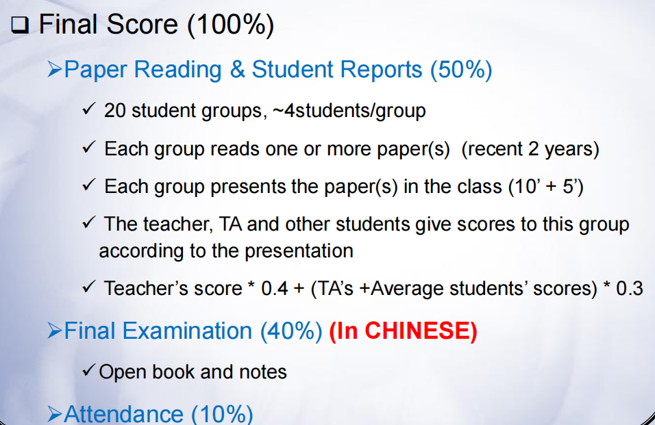

## 人体生物特征识别技术

**课程性质**：计算+X（2021级-2024春）

**学分**：2.0（2021级-2024春）

**分数构成** = **10%** 平时分 + **50%** 小组汇报分 + **40%** 期末考试（开卷考试）（2021级-2024春）

    

### 关于课程

#### 1. 总体介绍

这门课几乎每节课都签到，助教会在课间休息时拍照

课程大纲：

    

#### 2. 关于授课

- 教师1 wxq

PPT几乎是纯英文，但是中文授课

#### 3. 关于小组作业

4人一组，选取近年来的顶刊中有关人体生物特征识别的文章进行汇报。要求做PPT，最后三节课会上台展示（15分钟讲+5分钟提问）。组里的每位同学都会上去讲解，且每个同学上台顺序由老师随机确定。在讲解过程中老师会随机打断并提出问题。要求台下的同学进行评分，下课时将打分结果交给助教作为签到。

#### 4. 关于考试

（2021级-2024春）

考试共十一道题

- 一、生物特征识别技术的定义及其优势

- 二、解释：注册、认证、识别、模板、匹配的定义

- 三、已知已注册者和未注册者分别对系统进行10000次测试，分别被系统接受了9900次和99次，计算该系统FAR和FRR

- 四、用最小距离分类器给一个点进行分类，描述分类过程

- 五、Sobel滤波器是高通滤波器还是低通滤波器？并给一个图像进行滤波

- 六、掌纹图像中的基本特征有哪些？描述掌纹图像的预处理过程

- 七、简述语音识别、声音识别、声音验证的概念和区别，并列举声音识别中所用到的各种特征

- 八、描述基于PCA变换的人脸识别过程

- 九、结合掌纹和指纹描述多模态生物特征识别的不同层次、并画出不同层次融合的框图

- 十、深度学习三要素。根据连接方式，人工神经网络的网络结构有哪些？为什么卷积神经网络比较适合于基于图像的生物特征识别？

- 十一、设计一个完整联机足纹识别系统，画出系统框图并描述详细的设计过程

>问题基本在PPT上可以找到答案，但由于PPT是英文，可能需要提前自己翻译一下

### 一些可能有用的资源

### 学习经验

### 参考书目
- D. Zhang. Automated Biometrics: Technologies & Systems, Kluwer Academic Publishers, 2000.
- D. Zhang, et al. Advanced Biometrics, Springer International Publishing, 2018.
- Xiangqian Wu, et al. Palmprint Recognition, Scientific Publisher,2006 (Chinese)
- Jiang, R., et al. Deep Biometrics, Springer International Publishing, 2020.
- IEEE Transactions on Pattern Analysis and Machine Intelligence (T-PAMI) (Weight: 5)
- IEEE Transactions on Image Processing (T-IP) (Weight: 4)
- IEEE Transactions on Information Forensics and Security (T-IFS) (Weight: 4)
- Other Journals of IEEE(Weight: 3)
- Pattern Recognition (PR) (Weight: 4)
- IEEE Conference on Computer Vision and Pattern Recognition (CVPR)(Weight: 5)
- IEEE International Conference on Computer Vision (ICCV) (Weight: 5)
- European Conference on Computer Vision (ECCV) (Weight: 5)
- International Conference on Biometrics (ICB) (Weight: 3)
