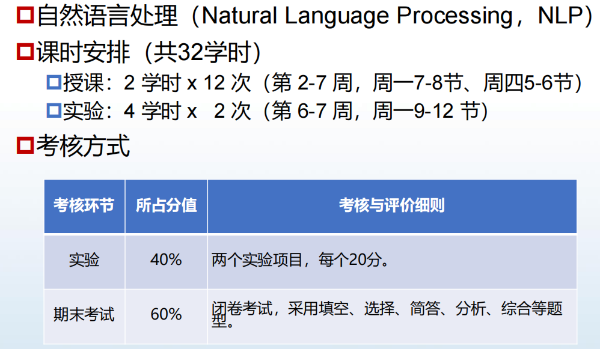
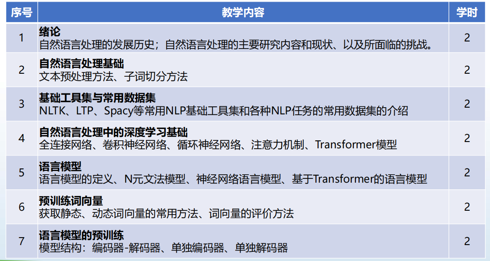
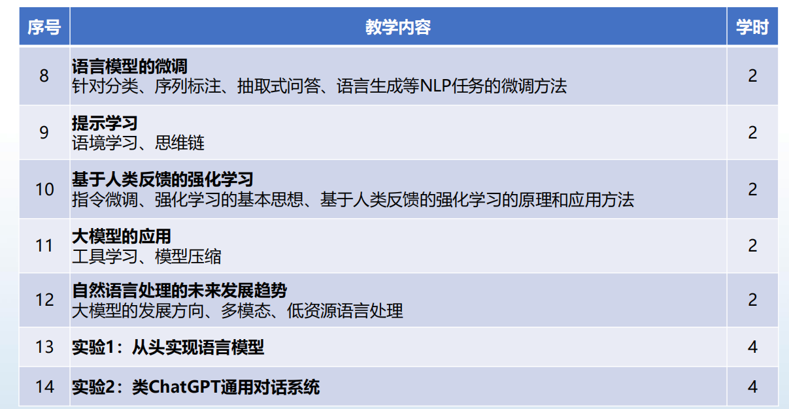

## 自然语言处理

**课程性质**：专业限选（2021级-2024春）

**学分**：2.0

**分数构成** = **40%** 实验分 + **60%** 期末考试（2021级-2024春）

### 关于课程
#### 1. 总体介绍

    

    

    

#### 2. 关于授课

- 教师1 ymy

上课不点名，实验课也不点名

#### 3. 关于实验

实验一：从零开始实现基于Transformer的语言模型

实验二：基于 chatglm3-6b 模型的 lora 方法微调

都是需要在服务器上部署的，整体来说还是比较容易完成。

> 具体见同一文件夹下的实验指导书

#### 4. 关于考试

（2021级-2024春）
闭卷考试

考试内容和前几年差不多

[哈工大2022秋自然语言处理NLP期末考试回忆版试题](https://blog.csdn.net/qq_51661180/article/details/129103296)

[哈工大2022年秋自然语言处理期末考试](https://blog.csdn.net/sanjinpal/article/details/129139369)

### 一些可能有用的资源

### 学习经验

### 参考书目

- 自然语言处理：基于预训练模型的方法
